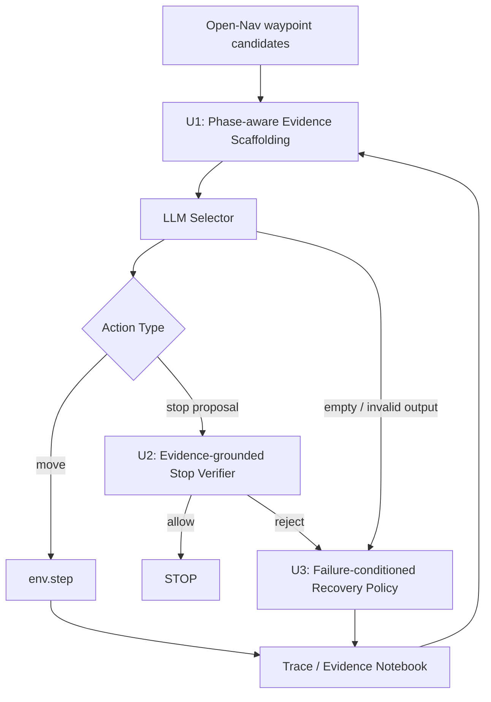

---
tags:
  - 实验
  - Open-Nav
  - VLN-CE
  - agent
  - harness
  - 创新点
status: draft
created: 2026-06-19
updated: 2026-06-19
title: 新论文创新点引入
aliases:
  - 新论文创新点引入-收束版
related:
  - "[[Qwen-RobotNav]]"
  - "[[FORESIGHT]]"
  - "[[HSGM]]"
  - "[[Context-Nav]]"
  - "[[AgentVLN]]"
  - "[[../实验方案|Controlled Navigation Harness 实验方案]]"
---

# 新论文创新点引入

> 这份文档的定位已经从“论文点子清单”调整为“可进入实验方案的收束版设计”。
>
> 核心判断：**小机制可以保留为 trace 字段和工具实现细节，但论文方法与实验变量必须收束到少数中粒度机制。**

---

## 0. 收束结论

当前设计确实有“模块过细”的风险。原来的 I1-I8 更适合作为机制池，不适合作为最终论文方法。如果每个小机制都单独作为创新点，会带来三个问题：

| 风险 | 后果 |
|------|------|
| 实验变量过多 | 很难判断到底是哪一个机制真正生效 |
| 贡献表述碎片化 | 论文容易变成工程功能堆叠，而不是一个清楚方法 |
| 消融矩阵爆炸 | A0/A1/A2+ 的受控边界会被大量开关污染 |

因此，建议把新论文启发收束成三个中粒度创新单元：

| 单元 | 名称 | 合并的小机制 | 主要解决问题 |
|------|------|--------------|--------------|
| U1 | Phase-aware Evidence Scaffolding | context mode、progress state、candidate evidence、evidence notebook、observation budget | 后半程 drift、V4 视觉上下文噪声、候选证据组织混乱 |
| U2 | Evidence-grounded Stop Verifier | visual target verifier、relation verification、weak final target gate、near-goal evidence、STOP rescue/reject | STOP 误停、漏停、弱终点判断不稳 |
| U3 | Failure-conditioned Recovery Policy | critic diagnostic、empty fallback audit、fallback ranker、recovery trigger、trajectory evidence | empty fallback 退化、走错后不会恢复、失败类型不可分 |

一句话原则：

```text
trace 可以细，method 不能碎；
日志字段可以多，实验变量必须少；
小机制作为实现细节，中粒度单元才作为论文贡献。
```

---

## 1. 当前证据与边界

### 1.1 已知事实

来自当前 [[../实验方案|实验方案]] 的实验边界：

```text
A0: Open-Nav original baseline
A1: Instrumented / harnessed baseline，只加日志，不改行为
A2+: decision-impact variants，逐步启用会改变动作的机制
```

A1 必须满足：

```text
enable_harness_logging = true
enable_decision_effect = false
```

因此，所有新论文点子进入系统时，都应先经历：

```text
paper idea
  -> diagnostic field / trace event
  -> paired case study
  -> controlled policy switch
  -> ep100 validation
```

### 1.2 当前实验症状

| 症状 | 当前观察 | 暂定判断 |
|------|----------|----------|
| V2/V4 有 decision-effect，但 SR 仍低 | 当前约 `0.16-0.17` | 不能继续无差别堆功能 |
| `visual_stop_rescued` 成功少 | 当前约 `1/24` | STOP rescue 规则过宽，误放严重 |
| empty fallback 高频 | `selector_empty_prediction_fallback=79`，其中 `41/79` 仍选原始第一候选 | fallback 没有真正改变动作质量 |
| 后半程移动收益差 | step>=4 move actions 中负收益/非正收益比例高 | 缺少阶段状态和进度约束 |
| 弱终点漏停 | OSR=1 但 SR=0 | STOP gate 没有区分强物体目标和弱区域目标 |

### 1.3 用户偏好与硬约束

- 不污染 A0/A1。
- 不把 Qwen-RobotNav 这类训练式 foundation model 直接替换进 Open-Nav。
- 不做自由工具调用式 agent。
- 不做多 sub-agent 在线协作。
- 每个会改变动作的机制必须可开关、可消融、可回滚。
- 论文叙事要围绕一个受控 agent/harness，而不是模块拼盘。

---

## 2. 为什么不能按 I1-I8 直接做

原来的 I1-I8 各自都有价值，但粒度不一致：

| 原编号 | 原机制 | 更适合的位置 |
|--------|--------|--------------|
| I1 | Phase-aware Context Mode | U1 的阶段状态 |
| I2 | Trajectory Evidence Notebook | U1/U3 的 trace 压缩 |
| I3 | Critic-as-Diagnostic | U3 的失败类型诊断 |
| I4 | Progress State Machine | U1 的进度状态，U2 的弱终点证据 |
| I5 | Semantic-Geometric Candidate Evidence | U1 的候选证据 |
| I6 | Relation-aware Target Verification | U2 的核心机制 |
| I7 | Context-driven Recovery Trigger | U3 的核心机制 |
| I8 | Resource / Observation Budget Policy | U1 的观察预算 |

真正的问题不是“小模块没用”，而是不能让它们都成为独立实验变量。合理做法是：

```text
小模块：作为 trace / tool / field / prompt slot
中粒度单元：作为 decision-effect 实验变量
最终论文：只写 2-3 个主贡献
```

---

## 3. 收束后的总体方法

新的方法主张可以写成：

> 本实验提出一个面向零样本 VLN-CE 的 phase-aware, evidence-grounded, ablation-safe controlled navigation harness。它不把 LLM 变成自由 agent，而是将阶段状态、证据组织、停止验证和失败恢复显式化，使 Open-Nav 的关键决策可诊断、可消融、可回滚。

整体结构：



三个单元的边界：

| 单元 | 改什么 | 不改什么 |
|------|--------|----------|
| U1 | 改 selector 看到的结构化证据和视觉上下文槽位 | 不直接决定 STOP，不做 recovery |
| U2 | 只在 STOP proposal / near-goal 情况下验证是否应该停 | 不重排普通 move candidate |
| U3 | 只在明确失败触发后选择受限恢复动作 | 不每步接管 planner，不做自由多轮推理 |

---

## 4. U1：Phase-aware Evidence Scaffolding

### 4.1 旧方法弱点

Open-Nav 的 LLM selector 在不同阶段使用近似统一的上下文。V4 加入视觉证据后，如果不区分阶段，可能出现：

- search 阶段被局部视觉细节干扰；
- approach 阶段缺少当前子目标约束；
- verify 阶段仍被普通 move 证据污染；
- recover 阶段不知道刚才为什么失败。

[[Qwen-RobotNav]] 的启发不是“换模型”，而是把 task / observation config 显式化；[[HSGM]] 的启发是维护子任务进度；[[AgentVLN]] 和 [[HSGM]] 的启发是让候选具备语义-几何证据。

### 4.2 当前问题

当前 V4 已经进入 decision-effect，但没有稳定提升。合理怀疑是：

```text
视觉证据本身未必无效，
但统一视觉上下文在错误阶段注入了错误证据。
```

### 4.3 核心假设

导航不同阶段需要不同证据。相比“每步给 LLM 同一类上下文”，显式阶段状态可以减少后半程 drift，并提高 selector 对当前子目标的稳定性。

### 4.4 最小字段

```yaml
phase_evidence:
  phase: search | approach | verify | recover | unknown
  current_subgoal: str
  phase_reason: str
  visual_budget: low | medium | high
  evidence_slots:
    - instruction_summary
    - current_subgoal
    - candidate_semantic_geometric_evidence
    - recent_progress
    - target_evidence
  confidence: float
```

候选证据只保留必要字段：

```yaml
candidate_evidence:
  candidate_id: int
  geometry:
    projection_valid: bool
    depth_valid: bool
    occupancy_risk: low | medium | high | unknown
  semantics:
    matched_constraints: list
    failed_constraints: list
    visual_support: str
  progress:
    matches_current_subgoal: bool | unknown
  risk:
    revisit_risk: low | medium | high | unknown
```

### 4.5 决策边界

U1 只影响 `ContextBuilder / Scaffolding`：

| phase | selector 主要看到什么 | 不应该看到什么 |
|-------|----------------------|----------------|
| search | instruction、route pattern、top-k 候选概览 | 过多 target crop、复杂历史 |
| approach | current_subgoal、candidate evidence、recent progress | 全量 episode history |
| verify | 交给 U2 的 STOP evidence | 普通 move prompt 噪声 |
| recover | 交给 U3 的 failure evidence | 未分类的失败日志堆叠 |

### 4.6 消融设计

| 配置 | 含义 | 是否改变动作 |
|------|------|--------------|
| A1-U1-log | 只记录 phase / evidence，不改 prompt | 否 |
| V4-unified | 当前统一视觉上下文 | 是 |
| U1-phase-aware-V4 | 按 phase 选择 evidence slots | 是 |

每次只比较：

```text
V4-unified vs U1-phase-aware-V4
```

不要同时打开新的 STOP verifier 或 fallback recovery，否则无法归因。

### 4.7 指标与通过标准

| 指标 | 期望 |
|------|------|
| `phase=unknown` 比例 | 不能过高，否则 phase classifier 不可靠 |
| step>=4 negative distance-gain ratio | 相比 V4-unified 下降 |
| SPL / nDTW | 不应明显下降 |
| SR | 至少不低于 V4-unified，最好稳定提升 |
| selector 失败类型 | `visual_context_noise` / `progress_drift` 比例下降 |

U1 的成败不看单个 case 是否“看起来合理”，而看后半程动作质量是否系统性改善。

---

## 5. U2：Evidence-grounded Stop Verifier

### 5.1 旧方法弱点

STOP 不是普通 action selection。普通 move 是“哪个候选更好”，STOP 是“当前是否已经满足目标条件”。如果把 STOP 当成普通候选选择，容易出现两类错误：

| 错误 | 表现 |
|------|------|
| false positive | 看到相关物体或房间线索就提前停 |
| false negative | 已到目标附近，但 final target 是 room / doorway / area 等弱目标，系统继续走 |

[[Context-Nav]] 的关键启发是：目标验证应检查上下文关系，而不只是检查目标外观。

### 5.2 当前问题

当前 `visual_stop_rescued` 成功很少，说明“视觉上看见相关目标”不足以放行 STOP。弱终点任务中又存在 OSR=1 / SR=0，说明 gate 也可能过严。

### 5.3 核心假设

STOP 应该由证据驱动的 verifier 决定，而不是由 LLM selector 单独决定。verifier 需要同时检查：

- intrinsic evidence：目标或目标区域是否存在；
- relation evidence：是否满足 near / left_of / inside / before / facing 等关系；
- trajectory evidence：是否已经到达应停阶段；
- weak-target evidence：目标是否本来就是弱物体或区域描述。

### 5.4 最小字段

```yaml
stop_verification:
  stop_proposed_by: llm | near_goal_gate | rescue
  target_type: object | room | area | landmark | weak_target | unknown
  intrinsic_support: yes | no | unknown
  relation:
    relation_type: near | left_of | right_of | before | inside | facing | unknown
    anchor: str
    support: yes | no | unknown
  trajectory_support: yes | no | unknown
  weak_target_adjustment: none | relax | block
  allow_stop: bool
  reject_reason: str
  confidence: float
```

### 5.5 决策边界

U2 只在以下情况触发：

- LLM selector 提出 STOP；
- near-goal gate 触发；
- visual rescue 试图放行 STOP；
- weak final target 需要特殊判断。

U2 不参与普通 move candidate rerank。

### 5.6 消融设计

| 配置 | 目的 | 是否改变动作 |
|------|------|--------------|
| V2-original | 当前 STOP verifier / rescue | 是 |
| V2-rescue-off | 关闭 visual rescue，观察是否减少误停 | 是 |
| U2-relation-aware | 加入 relation blocker | 是 |
| U2-weak-target-adjusted | 对 room / area / doorway 等弱目标调整 gate | 是 |

建议顺序：

```text
V2-original
  -> V2-rescue-off
  -> U2-relation-aware
  -> U2-weak-target-adjusted
```

不要一开始就把 relation-aware 和 weak-target adjustment 同时打开。

### 5.7 指标与通过标准

| 指标 | 期望 |
|------|------|
| STOP precision | 高于当前 visual rescue |
| STOP recall | 不因 rescue-off 大幅下降 |
| `visual_stop_rescued` precision | 必须明显高于 `1/24` |
| OSR=1 / SR=0 | 弱终点漏停减少 |
| `stop_false_positive` | 下降 |
| `stop_false_negative` | 不上升或下降 |

U2 的贡献可以写得很清楚：它把 STOP 从“LLM 的一个动作选项”改成“目标满足性验证问题”。

---

## 6. U3：Failure-conditioned Recovery Policy

### 6.1 旧方法弱点

当前 fallback 更像异常处理，而不是恢复策略。`selector_empty_prediction_fallback=79` 中大量仍然选回原始第一候选，说明 fallback 没有真正利用失败证据。

[[FORESIGHT]] 的启发不是照搬在线 planner-critic-refinement，而是让 critic 帮助识别“当前失败属于哪一类”。恢复策略应该依赖失败类型，而不是统一套一个 fallback。

### 6.2 当前问题

empty fallback、连续负收益、STOP reject、loop 这些事件混在一起处理，会导致：

- 明明是 selector 空输出，却按普通候选排序继续走；
- 明明是 progress drift，却没有回到当前子目标；
- 明明是 stop false positive，却没有给出替代 move；
- 明明是候选缺失，却还在 top-k 内反复选择。

### 6.3 核心假设

失败恢复应该先分类，再执行受限策略：

```text
failure event
  -> failure_type
  -> allowed recovery actions
  -> one-step constrained recovery
```

### 6.4 最小字段

```yaml
recovery_state:
  trigger:
    type: selector_empty | negative_gain | loop | stop_rejected | candidate_missing
    step: int
  failure_type: progress_drift | selector_wrong | empty_fallback_bad | stop_false_positive | candidate_missing | unknown
  evidence:
    - recent_distance_gain
    - rejected_stop_reason
    - repeated_view
    - current_subgoal
    - candidate_evidence
  allowed_recovery:
    - reselect_from_topk
    - rotate_disambiguation
    - continue_current_subgoal
  selected_recovery: str
  budget_remaining: int
```

### 6.5 决策边界

U3 只在受限触发条件下生效：

| 触发 | 允许动作 |
|------|----------|
| selector empty | 从 top-k 重新选择，不扩展自由动作空间 |
| 连续负收益 | 检查 current_subgoal，再受限 reselect |
| STOP rejected | 选择与 reject reason 不冲突的候选 |
| loop / repeated view | 只允许一次 rotate_disambiguation 或 top-k 替代 |

U3 不做多步自由规划，不让 critic 每步改写 planner。

### 6.6 消融设计

| 配置 | 目的 | 是否改变动作 |
|------|------|--------------|
| F0-original-empty-fallback | 当前 fallback 行为 | 是 |
| U3-failure-type-log | 只标注 failure_type | 否 |
| U3-reselect-only | 按 failure_type 做 top-k reselect | 是 |
| U3-progress-aware-recovery | 加入 current_subgoal / evidence notebook | 是 |

建议先只做：

```text
F0-original-empty-fallback vs U3-reselect-only
```

如果最小 reselect 都没有收益，不要继续扩展复杂 recovery。

### 6.7 指标与通过标准

| 指标 | 期望 |
|------|------|
| post-fallback distance gain | 提升 |
| fallback 后再次失败比例 | 下降 |
| first-order fallback ratio | 下降 |
| step length limit 触发 | 下降 |
| late-stage drift | 下降 |

U3 的重点不是“让机器人更聪明地聊天”，而是让恢复动作有明确失败依据。

---

## 7. 更新后的实验矩阵

### 7.1 Baseline 与诊断层

| 编号 | 配置 | 目的 | 是否改变动作 |
|------|------|------|--------------|
| A0 | Open-Nav original | 固定原始 baseline | 否 |
| A1 | Harness logging only | 验证外壳不改行为 | 否 |
| A1-Ulog | U1/U2/U3 全部 trace 字段 log-only | 建立统一失败证据 | 否 |

A1-Ulog 可以一次记录多个小字段，因为它不改变动作。但 A2+ 不能一次启用多个新决策单元。

### 7.2 单元级 decision-effect

| 单元 | 对照组 | 实验组 | 核心问题 |
|------|--------|--------|----------|
| U1 | V4-unified | U1-phase-aware-V4 | 阶段化证据是否减少 drift |
| U2 | V2-original / V2-rescue-off | U2-relation-aware / U2-weak-target-adjusted | STOP verifier 是否提高停靠质量 |
| U3 | F0-original-empty-fallback | U3-reselect-only | 失败类型恢复是否优于机械 fallback |

### 7.3 组合层

只有当单元级实验通过，才进入组合实验：

| 配置 | 目的 |
|------|------|
| U1 + U2 | 检查阶段化证据是否改善 STOP 前上下文 |
| U1 + U3 | 检查阶段化证据是否改善恢复触发 |
| U1 + U2 + U3 | 最终系统，不作为单元归因依据 |

组合系统只用于最终性能展示，不用于证明某个机制单独有效。

---

## 8. 归因规则

为了避免“看起来都加了，所以不知道谁有效”，后续实验必须遵守：

1. A0/A1 永远不改变动作。
2. A1-Ulog 可以记录所有 trace，但不允许改 prompt、不允许 rerank、不允许改 STOP / fallback。
3. 每次 ep100 只开启一个中粒度 decision-effect 单元。
4. 每条轨迹记录 `decision_effect_unit`。
5. 每次动作同时保留：
   - Open-Nav 原始候选；
   - 原始 selector 输出；
   - 新单元建议；
   - 最终执行动作；
   - 是否发生 override。
6. 如果一个收益只在组合系统中出现，而单元级实验没有收益，论文中不能把它写成单元贡献。

推荐日志字段：

```yaml
decision_audit:
  unit_enabled: none | U1 | U2 | U3 | combined
  original_action: str
  proposed_action: str
  final_action: str
  override: bool
  override_reason: str
  expected_failure_addressed: progress_drift | stop_error | fallback_error | none
```

---

## 9. 与相关论文的对应关系

| 论文 | 可吸收的思想 | 在本文方法中的位置 | 不吸收的部分 |
|------|--------------|--------------------|--------------|
| [[Qwen-RobotNav]] | task / observation config，阶段化视觉预算 | U1 | 不替换为训练式导航基础模型 |
| [[FORESIGHT]] | clue critique，失败线索诊断 | U3 | 不做每步自由 planner-critic-refinement |
| [[HSGM]] | subtask state，语义-几何证据 | U1，少量辅助 U2 | 不复现完整地图 + A* |
| [[Context-Nav]] | relation-aware target verification | U2 | 不迁移完整 ObjectNav pipeline |
| [[AgentVLN]] | skill/tool 边界、2D-3D evidence | U1 的 candidate evidence | 不训练 AgentVLN-Instruct，不改成技能策略 |

这张表的作用是防止论文启发被误读成“照搬最新方法”。当前实验只吸收它们的结构性思想，并保持 Open-Nav zero-shot waypoint baseline 的对照条件。

---

## 10. 论文贡献表述

如果后续实验成立，论文贡献可以压缩为三点：

1. **Phase-aware Evidence Scaffolding**
   - 将 VLN-CE 中的 search / approach / verify / recover 阶段显式建模；
   - 按阶段组织候选语义-几何证据、进度状态和视觉上下文；
   - 解决统一上下文导致的后半程 drift 和视觉噪声问题。

2. **Evidence-grounded Stop Verification**
   - 将 STOP 从普通动作选择中分离出来；
   - 使用 intrinsic / relation / trajectory / weak-target evidence 判断目标满足性；
   - 降低误停，同时缓解弱终点漏停。

3. **Failure-conditioned Recovery**
   - 将 empty fallback、负收益、STOP reject、loop 等事件归入失败类型；
   - 根据失败类型执行受限恢复，而不是机械选择默认候选；
   - 保持恢复策略可审计、可消融、可回滚。

英文摘要式表述：

> We propose a phase-aware, evidence-grounded controlled navigation harness for zero-shot VLN-CE. Instead of turning the LLM into a free-form agent, the system exposes navigation phase, candidate evidence, stop verification, and recovery triggers as structured state and controlled tools. This makes agentic navigation decisions auditable, ablation-friendly, and compatible with the original waypoint-based Open-Nav baseline.

---

## 11. 不应引入的内容

| 不引入 | 原因 |
|--------|------|
| 直接替换为 Qwen-RobotNav | 它是训练式 foundation model，会破坏当前零样本 Open-Nav 设定 |
| 直接复现 HSGM 完整地图 + A* | 会替换 waypoint predictor 和执行接口，收益难归因 |
| FORESIGHT 式每步 planner-critic-refine | 调用成本高，且会引入自由推理变量 |
| Context-Nav 完整 ObjectNav pipeline | 任务定义不同，不是 VLN-CE route following |
| 多 sub-agent 在线协作 | 与 controlled harness 边界冲突 |
| 大规模 prompt 重写 | 会污染 A0/A1/A2+ 对照 |
| memory 默认拼进 selector | 容易放大噪声，应先保持 log-only |

---

## 12. 最小落地顺序

短期不建议同时实现三个完整单元。更稳的顺序是：

| 顺序 | 任务 | 原因 |
|------|------|------|
| M0 | 固定 A0/A1 行为等价验证 | 没有这个，后续所有收益都不可归因 |
| M1 | 建立 A1-Ulog：phase / stop / failure 三类 trace | 先获得统一证据面 |
| M2 | 优先做 U2 的 rescue-off 与 relation-aware case study | STOP 问题最局部，最容易验证 |
| M3 | 做 U3 的 empty fallback failure_type 标注与 reselect-only | 当前 fallback 样本多，适合归因 |
| M4 | 做 U1 的 phase-aware V4 | U1 影响面最大，应在 phase 可靠后进入 decision-effect |
| M5 | 组合 U1+U2、U1+U3，最后再做全系统 | 组合只用于最终展示 |

最小可执行版本：

```text
A1-Ulog:
  phase_evidence
  stop_verification
  recovery_state
  decision_audit

Decision-effect:
  first: U2 only
  second: U3 only
  third: U1 only
```

---

## 13. 一句话结论

最新论文给当前实验的最大启发不是“再加一个强模型”，而是：

```text
把导航 agent 的阶段、证据、停止验证和失败恢复
从 LLM 的隐式 prompt 行为中拆出来，
变成可记录、可调度、可消融、可回滚的 Harness 接口。
```

最终论文不应写成“引入 8 个模块”，而应写成：

> **一个 phase-aware、evidence-grounded、ablation-safe 的 VLN-CE controlled navigation harness。**
