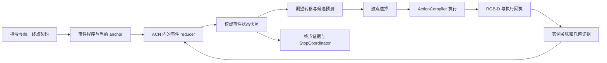

# 物理事件导航构想与当前实验对照评估

本文评估用户提供的 26 项构想，对照当前代码、配置和完整 EP100 原始结果，给出应保留的主线、需要修正的论断和下一轮实验顺序。**它是一份研究与实施建议，不表示所提方法已经实现，也不替代实验结果。**

评估快照：2026-09-16，仓库 `/root/My-Experiment`；HEAD 为 `0d8505a4a7e93136753e5a790ae644c9e03303ae`，存在未提交修改，以下代码判断以工作区文件为准。本文重新统计了已有日志，未启动新的 Habitat、VLM 推理或在线导航实验。

## 1. 总体判断

**建议保留“以可观测物理事件约束动作完成，并用期望事件转移指导选路”这条主线。当前证据足以支持研究这个问题，尚不足以支持“闭环已经有效”“能够大幅提升 SR”或“减少模型规模依赖”三个结论。**

原文最有价值的变化，是把工作从终点 STOP 门控，推进到整个动作执行过程；最需要修改的部分，是把研究重要性、工程前置条件和预期性能收益混排成同一优先级。

建议区分三层：

| 层次 | 本阶段要回答的问题 | 不能混入的结论 |
|---|---|---|
| 工程正确性 | 同一终点是否贯穿各模块？没有目标确认会不会直接 STOP？ | 修复确定性 bug 不等于物理事件方法的收益 |
| 事件验证有效性 | 同一对象/边界上的动作是否真实发生？能否区分早完成、漏完成和错误实例？ | route complete 增多不等于正确完成增多 |
| 导航策略有效性 | 期望状态是否让下一步选择更好，进而改善 SR/OSR/SPL？ | completion 指标变好不必然带来更好的轨迹 |

**建议的新顺序：终点契约修复 → 冻结可复现基线 → PASS 评测定义与最小实例几何 → PASS 状态验证 → 期望状态指导 → 配对在线验证 → CROSS/其他事件 → 模型规模与效率。**

相对原文，主要调整是：把评测定义和实例几何前置；把“单一状态”收敛为单一权威写入口；把“不要所有证据 AND”改为区分必要条件与可替代证据；将 KV 和大规模模型对比留到主闭环成立之后。

## 2. 当前实验到底证明了什么

### 2.1 三轮完整 EP100：指标核对

以下均为 `val_unseen`、100 episodes，数值来自各轮 aggregate JSON；缩写与路径见文末证据索引。[E1–E3]

| 运行 | SR | OSR | SPL | nDTW | 平均最终距离/m | 平均步数 |
|---|---:|---:|---:|---:|---:|---:|
| 09-02 terminal_track_v3 | 20% | 38% | 0.1098 | 0.3416 | 7.6843 | 9.70 |
| 09-09 target_binding_v33 retry | 14% | 31% | 0.0871 | 0.3361 | 7.8645 | 7.74 |
| 09-09 启动、09-10 完成 parser_v22_prior_logonly | **22%** | **30%** | **0.1244** | **0.3651** | **7.4834** | **10.04** |

最新运行的 manifest 记录 Qwen3.5-4B、seed=0、`acn_l1`、10/12 步预算；resolved config 中 candidate prior 为 log-only。当前还包含 RAM、SpatialBot、预训练 waypoint predictor 等模块，不能把整个系统成本等同于一个 4B 模型。[E1, C7]

从 14% 到 22% 的变化，重新按 episode ID 对齐后为：

| 子集 | 数量 | 上轮成功 → 本轮成功 | 上轮 OSR 命中 → 本轮 OSR 命中 |
|---|---:|---:|---:|
| 上轮解析失败、本轮恢复 | 24 | 0 → 6 | 0 → 9 |
| 上轮已有有效计划 | 76 | 14 → 16 | 31 → 21 |
| actions/landmarks 文本完全相同的子集 | 62 | 10 → 13 | 25 → 17 |

第三行是前两行相关样本的另一个切片，不能相加。新增 8 个成功中，有 6 个来自恢复可运行样本；原可运行集合的 OSR 反而少了 10 个。解析、prior 和其他行为变更同时存在，因此不能把差异归因给单个模块。[E4–E5]

本次额外计算了两轮 100 项 SR 的配对变化：**18 项失败转成功、10 项成功转失败**，双侧精确 McNemar `p=0.1849`。这不支持在常用 0.05 阈值下宣称稳定改善；也不证明方法无效。两轮本来就不是单变量实验，显著性检验不能弥补混杂因素。

### 2.2 22% SR 不能读成 22% 的正确自主完成

从最新原始日志重算：[E4]

| 结束方式 | episodes | SR 成功数 | OSR 命中数 |
|---|---:|---:|---:|
| 达到步数上限 | 97 | 21 | 29 |
| 正式 STOP | 3 | 1 | 1 |
| 合计 | 100 | 22 | 30 |

当前 trainer 在结算时按 `distance[-1] <= 3` 计算 success，按轨迹中是否曾 `distance <= 3` 计算 oracle_success；success 不要求一定由正式 STOP 结束。这里描述的是**本项目实际实现的评价口径**，不能直接推广到所有 VLN 实现。[C7，约 5261 行]

正式 STOP 为 EP166、1117、824，最终距离分别为 **10.948m、7.137m、2.847m**。其中 EP1117 的 `goal_complete=true`、`terminal_target_confirmed=null`；EP166 内部确认为真，却停在错误位置。它们分别代表契约错误和感知证据错误，不能用同一个 confidence 阈值解决。

因此应同时报告：现有 SR/OSR/SPL、正式 STOP 覆盖率、正式 STOP 的目标半径命中率、以及经过独立标注的事件/指令完成率。正式 STOP 命中率 1/3 样本极少；即使进入目标半径，也还不能证明整条指令都被正确执行。

### 2.3 动作事件缺口真实存在，但不是“30 个可直接挽回的成功”

以每个 episode 最后一次 `goal_progress_update.current_action.evaluation.unsupported_requirements` 为口径，重算如下：[E4]

| 最终未实现验证器 | episodes | SR 成功数 | OSR 命中数 |
|---|---:|---:|---:|
| PASS | 13 | 2 | 3 |
| CROSS | 9 | 1 | 1 |
| TRAVERSE | 8 | 2 | 2 |
| 去重并集 | **30** | **5** | **6** |

这是“结束时仍卡在这些事件”的数量，不是全数据中包含这些动作的总频率，也不是经过因果诊断确认的失败归因。30 项中 24 项从未进入成功半径，说明补完成判定之外，仍需研究轨迹如何改变。

在**完全固定已记录轨迹、仅重新选择停止时刻**的离线假设下，全体轨迹的理想停止 SR 上限是 OSR=30%，相对当前 22% 最多有 8 个百分点；上述 30 项内部只有 6−5=1 项这样的净缺口。这个上限不适用于改变路线推进、航点或观察预算后的在线方法，也不意味着实际 verifier 能达到这个上限。

这为上游选路研究提供了动机，但还不能说明 Expected Transition 就是最有效的解决方案。

### 2.4 当前确实有两项前置缺陷

**终点契约没有贯通。** parser 的第二阶段读取 `terminal_target`，但返回给后续的主要是 landmarks；`build_anchor_chain(actions, landmarks)` 再次推断终点。`ProgressProvider` 又以 `terminal_policy.present`——是否存在显式停止指令——决定终点确认是否必需。当前工作区仍保留这一逻辑。[C1–C3]

明确案例包括 EP1117 的 pool/bar、EP176 的 bathroom/gym、EP568 的 hallway/指定画框、EP677 的 first door/bathroom。历史分析报告统计 14/100 不一致；本次按最后一次记录做**严格字符串不相等**检查得到 20/100。两者不是同一口径：字符串差异包含 `pool`/`next to the pool` 等可解释差异，不能把 20 全部定性为语义错绑，也不能宣称已经复现了历史报告的 14。下一轮应输出逐项角色、实体与修饰语的审查表。[E4, D1]

**当前目标距离不是实例距离。** 最新日志 1004/1004 个 `terminal_spatial_evidence` 均为 `direction_local_surface_not_instance_mask`。已有 `TerminalInstanceTracker` 结合词项、方位、局部深度与位置关联，不等于已建立 mask 级物体身份；连续三帧内部一致，也可能一致地跟错对象。[C3, C7]

## 3. 原文 26 项逐项评估

下表“优先级”指实施顺序；论文重要性不等同于应先开发。

| 原序号 / 构想 | 评估 | 与当前实验的关系及建议 |
|---|---|---|
| 1 物理完成≠语义识别 | **保留为核心问题** | unsupported 事件和错误实例 STOP 提供动机；需要独立标注证明错误类型，暂不称“首次发现” |
| 2 Event-State-Guided Navigation | **核心假设，P1** | 值得验证是否改善路径；先消除终点错误、保证输入实例可信，不能预告大幅 SR 收益 |
| 3 Physical Event Program | **保留，修正创新论证** | 已有 action_spec/requirements 雏形；统一形式有工程价值，换成状态机名称不会自动消除手工规则性质 |
| 4 当前状态+期望状态 | **保留，P1** | 当前反馈没有明确物理 phase/expected phase；应表达可达转移集合，避免强行要求每步跨一个离散阶段 |
| 5 Single Source of Truth | **保留原则，调整结构，P0** | 已有 ACN 唯一进度源；在 RouteState/ACN 下挂权威事件状态，而非新增并行写入者或删除所有模块缓存 |
| 6 不用所有证据 AND | **必须重写，P0** | 可替代传感证据不必全齐；同一实例、真实运动、有效转移等必要条件仍需同时满足，unknown 不能当成功 |
| 7 先修 baseline | **最先执行，P0** | 终点绑定和 EP1117 不变量漏洞当前仍在；修复效果单独记账，prior 保持 log-only |
| 8 本地 4B+外置物理推理 | **保留为定位，P2 证实** | 4B 本地运行已成立；整套物理 grounding 尚未成立，系统还有其他感知模型与预训练航点模块 |
| 9 给小模型减负 | **可检验假设，P2** | 可能成立，也可能让错误状态更强地误导模型；需对比输入状态准确率与不同 backbone 的净收益 |
| 10 决策所需状态而非历史仓库 | **保留，P1** | 应称紧凑任务状态；其“充分性”未证明，路线约束、返回方向等必要信息仍要保留 |
| 11 短期感知+长期事件状态 | **保留，P1** | 3–5 步只是初始预算；低频决策可能漏过 BESIDE，需要保留关键帧/执行间隔证据 |
| 12 Future Physical State 评分 | **核心算法候选，P1** | 必须加坐标旋转、可达性与运动误差；当前 selector 没有可直接相加的校准语义分数 |
| 13 instance-level grounding | **前移为依赖，P0** | 既影响终点也影响 PASS；先选可定位对象完成小范围验证，无需第一版覆盖所有区域语义 |
| 14 PROBE | **延后独立消融，P2** | 已有 TerminalRecheck 不是通用主动消歧；区分证据暂缺与验证器未实现，后者不能靠反复探测解决 |
| 15 独立 Action Completion Eval | **前移，P0** | 先定义完成边界与 hard negatives，再写事件规则，避免规则和标签互相证明 |
| 16 Verification/Guidance 消融 | **必须做，P1** | 当前 ACN 进度已经进入 selector；V 的收益会包括进度变化带来的选路影响，应与新增期望状态指导区分 |
| 17 模型规模实验 | **保留，P2** | 主闭环稳定后做；不能把不同模型系列差异都归为参数规模，优先同系列可部署档位 |
| 18 Oracle Grounding Ceiling | **前移到离线诊断，P0/P1** | 使用相同冻结轨迹与事件逻辑；oracle 输入版本不是部署方法，也不等于可实现在线上限 |
| 19 Event-Conditioned KV | **后置，P3** | 与方法收益正交；兼容接口不自动代表服务端支持或实际命中 prefix cache |
| 20 KV 只负责计算复用 | **原则正确，P3** | 事实由显式状态维护；不引入未训练 latent token 注入 |
| 21 事件触发 KV 写入 | **保留为效率设想，P3** | 前缀变动会影响后续缓存，不能从 phase 次数直接推算实际节省；需要服务器级测量 |
| 22 借鉴 HiMemVLN | **保留，但限制类比** | 可借“状态参与每步决策”；不能把其论文总体增益全部归于 Localer，更不能推算本方法的 SR |
| 23 借鉴 EvoNav future | **保留思想，P1/P3 分开** | 下一动作/地标提示可作对照；跨 episode 经验与 GT 反馈另列协议，当前主实验不引入 |
| 24 Candidate Prior 暂不正式用 | **维持现状，P0** | 最新运行已有 log-only；原先强覆盖不是 Event Guidance 的正面证据，未来应分别归因 |
| 25 不做全历史 token memory | **同意当前不做** | 导航输入仍需原指令和全局约束；压缩历史要测遗漏率，不能只看 token 数 |
| 26 pruning/极致优化后置 | **大体同意，留一项例外** | 新推理架构后置；复用重复视觉调用可独立开展，因为当前每步视觉成本很高，但不可混入主效果 A/B |

## 4. 最需要修正的六个技术判断

### 4.1 证据可以互补，必要条件不能被投票替代

“正证据足够且没有强反证”仍然太宽：如果正证据来自错误实例、同一个 VLM 的重复回答，或执行前预测，就可能再次形成 EP166 式自洽错误。

建议写成：

\[
\mathrm{Complete}(E)=\mathrm{RequiredPredicatesSatisfied}(E)
\land\mathrm{SufficientAdmissibleSupport}(E)
\land\neg\mathrm{StrongContradiction}(E).
\]

- **必要谓词**：同一目标实例、足够的真实平移、符合动作语义的转移；复合动作的各项要求仍须成立。
- **可替代证据**：例如后侧重观测，或可信短时跟踪与执行位移共同证明已越过目标；不要求所有传感通道同时可见。
- **unknown**：遮挡、缺 mask、关联模糊。保持此前证据，但不生成新的完成事实。
- **contradiction**：确认换了实例、实际未发生所需平移、跨越了错误边界。触发核查、重置事件尝试或明确撤销。

对于“转向后经过目标”，应记录各子事件何时成立，按时间约束组合；不应要求先前转向和后续经过在同一帧都重新发生。证据需保存来源，不能把多个派生字段当成相互独立的支持。

### 4.2 单调的是已确认的事件履历，不是所有当前物理状态

`APPROACHING → BESIDE → AFTER` 描述一次理想 PASS 的进展，但 agent 可以退回、绕行、原地旋转。当前关系和历史完成必须分开：

| 状态 | 更新原则 |
|---|---|
| 当前距离、方位、所在边界一侧 | 随真实观察变化，可非单调 |
| 已确认的子事件及证据 | 保留时间戳；单帧缺失不清空 |
| 本次尝试 phase | 依据证据推进；明确失败/身份变更可重置，不因噪声随意回滚 |
| ACN 正式路线进度 | 唯一 reducer 推进；必要的撤销应有显式策略和日志 |

已经发生的“穿门事件”不会因之后退回而从历史消失；但“当前在门内”会变成 false。如果指令要求当前仍在房间内，终点谓词必须重新检查。原文将这些状态统一设为单调，会掩盖真实反例。

### 4.3 预测候选后的方位需要旋转，预测不能充当执行证据

原式 `r_next = r_now - delta_p` 只有在前后使用相同坐标朝向时才成立。若 `r_t` 在当前 agent 坐标系、候选移动为该坐标系下的 `Δp_i`，朝向变化为 `Δψ_i`，平面近似应为：

\[
\hat r_{t+1}^{(i)}=R(-\Delta\psi_i)(r_t-\Delta p_i),\qquad
\hat d_i=\|\hat r_i\|,\qquad
\hat\beta_i=\operatorname{atan2}(\hat r_{i,\mathrm{lateral}},\hat r_{i,\mathrm{forward}}).
\]

坐标轴和转角符号须按 ActionCompiler、相机外参及 Habitat 接口对齐。以上还假设静态目标、可靠相对位置和理想执行；碰撞、动作截断、定位误差都需要处理。

**候选图确实来自当前位置的分方向图像，代码没有先到候选位置拍未来图。** 因此预测只能用于比较候选是否可能推进事件，不能当作未来可见性或完成事实。[C7，`construct_image_dicts`]

应分别记录 `predicted_transition` 与 `observed_transition`：前者进入选路，后者只能在 ActionReceipt 和新观察到达后更新正式状态。几何可信度不足时退回原 selector，不能仅因目标没检测到就重罚候选。

### 4.4 PASS 不能只用“图像中从前到后”定义

原地转身也会改变 bearing。最小 PASS 验证至少需要同一实例、真实平移、接近后越过，以及符合指令的路线关系。可在一次尝试中建立稳定的运动参考方向，观察目标相对该方向的纵向投影由前侧跨到后侧，并结合最近距离、横向间距和对象范围；容差由独立开发集确定。

这只是候选判据，不能直接当作独立 GT 标签定义。也不能强制每段低频观察都采到 BESIDE：一个较长 waypoint 可能跨过该阶段。需要执行期间证据、关键帧，或满足可验证假设的轨迹段几何。

CROSS 要验证穿过**所指开口的有效范围**，仅跨越无限平面可能把穿过旁边的门或沿墙绕行判成成功。门框 mask、门洞区域、物体表面 mask 的深度语义不同；房间和关系区域不能靠一个普通物体 mask 解决。

### 4.5 单一真相源不等于全系统只有一个可变对象

当前已有 RouteState、ACN reducer、TerminalInstanceTracker、TerminalEvidenceMemory、视觉历史等不同作用域对象。[C3–C6] 把它们全部合并进一个巨大 ActionEventState，不一定更可靠。

建议采用：**一个正式 RouteState；当前 anchor 下一个权威 ActionEventState；观测、跟踪和特征缓存只生产带来源的 evidence；一个 reducer 提交状态；selector 只读快照；StopCoordinator 保持唯一 STOP 裁决入口。**

缓存、证据日志和只读投影可以有多份；anchor、instance、phase、版本号和事实确认必须只有一个正式写入口。模型提示里的文字不是第二套权威状态。

语言到事件结构的模块建议称 `InstructionCompiler/EventProgramCompiler`。现有 `ActionCompiler` 负责最终 STOP/waypoint 到执行命令的转换，不能把两个职责混用同一个名字。[C8]

### 4.6 状态机、外置物理推理与 training-free 都要准确限定

把 if/else 整理成 `PRE / TRANSITION / POST` 不会自动成为新方法。可形成贡献的内容应是：统一可复用的事件谓词、不确定性处理、预测与观察转移的闭环，以及跨场景、跨实例、跨动作验证。

“training-free”建议限定为：**所提事件与指导模块不做任务专用参数训练**。系统仍使用预训练感知和航点模型；若调阈值，要公开开发集，不能在报告结果的同一测试集上反复挑参数后称严格泛化。

当前日志明确记录 `position_source=simulator_agent_pose`。这不等于使用了终点或实例 GT，但它属于位姿来源假设，不能写成“纯 RGB-D 自主估计”。需按比较协议说明允许的定位输入；若目标是不依赖仿真真值位姿的部署，还需里程计替代或噪声实验。GT 目标距离、语义实例标注和参考路径只能留在离线评测通道。

## 5. 与当前代码衔接的最小设计

### 5.1 当前已有与缺失

| 能力 | 当前状态 | 本方案如何衔接 |
|---|---|---|
| 两阶段解析与 action_spec | 已有；终点独立字段未贯通 | 扩展显式契约，保留现有解析职责 |
| 唯一 ACN 进度源及三段完成状态 | 已有；隐式终点有漏洞 | 修正 predicate，新增不变量检查 |
| TURN、ENTER/EXIT 验证 | 已有转角/房间标签变化实现 | 不等于几何边界级 ENTER/EXIT；后续与边界证据对照 |
| PASS/CROSS/TRAVERSE | 明确 unsupported | 先接 PASS，其他继续返回 unknown |
| 当前动作反馈进入 selector | 已有 | 不等于 phase/expected-transition guidance |
| 终点跟踪、短时确认、受限复查 | 已有近似实现 | 复用执行接口和预算，升级实例证据 |
| mask 级定位与事件状态 | 当前主链未接入 | 新增最小 grounder adapter 与事件 reducer |
| 期望转移预测与候选事件评分 | 当前检索未找到实现 | 先记录预测和实际差异，再启用指导 |

### 5.2 建议数据契约

以下是**拟新增接口**，不是现有类定义：

```text
TerminalContract:
  required, explicit_stop, target_phrase, target_role,
  reference_phrases, relations, resolution_status, source_span

ActionEventState:
  episode_id, anchor_id, attempt_id, version,
  event_type, target_spec, instance_hypothesis,
  current_relation, confirmed_subevents, phase, expected_transitions,
  geometry_with_uncertainty, motion_reference,
  evidence_refs, missing_requirements, contradictions,
  completion_status, confirmed_at

CandidateEventPrediction:
  state_version, candidate_id, assumed_motion,
  predicted_relation, expected_progress, uncertainty,
  geometry_valid, abstain_reason
```

`required` 与 `explicit_stop` 必须分开。无显式 STOP 但有最终目标的指令仍需终点确认；真正没有可定位终点的指令，要明确非空间终止条件或 unresolved 状态，不能自动沿用“路线完成即目标完成”。

对于需要目标确认的指令，强制：

\[
\mathrm{goal\_complete}\Rightarrow
\mathrm{route\_progress\_complete}\land\mathrm{terminal\_target\_confirmed}.
\]

### 5.3 拟建立的控制闭环



第一版可先把 `PASS / APPROACHING / EXPECTED=BESIDE` 和可解释的候选几何摘要送入现有 selector，再单独验证显式候选重排的增量。

原文的 `S_semantic + λ S_event` 尚不是可直接接上的实现：当前主 selector 输出候选 ID，另有确定性投票，不提供校准的连续语义分数。若采用加权评分，必须先规定语义排序分的来源、归一化与缺失行为；不得把 Qwen 自报 confidence 或既有 prior 的 softmax gap 当作成功概率。

对“下一期望状态”的指导也不宜过硬：如果候选只能缩短到 BESIDE 的几何差距，而不能单步完成转移，仍可能是正确动作。应比较事件进展和可执行性，而不只奖励预测到终态的候选。
## 6. 评测必须先于扩大实现

### 6.1 先建立 PASS 的独立完成评测

第一版先覆盖明确物体实例的 PASS，不同时承诺 PASS、CROSS、ENTER、EXIT、TRAVERSE 全部有效。建议从开发集建立不少于 50 个完成片段和 50 个 hard-negative 片段作为工程试验集；这是建议的起始工作量，不是统计充分性的保证。最终样本数需根据事件分布和置信区间决定。

标签单位应为 `(episode, clause/anchor, target instance, event attempt, time interval)`，明确完成边界、允许的不确定区间，以及指令是否要求保持后置状态。标签由独立人工审阅或另行定义的仿真几何协议生成，不能直接复用被评估 verifier 的阈值规则。

必须覆盖：看到但未经过、靠近后折返、原地旋转、经过错误同类实例、遮挡后重现、跨步漏采 BESIDE、真实经过后又退回。最后一类要分别标“曾经发生 PASS”和“当前是否仍满足终点关系”。

| 指标 | 计算口径 |
|---|---|
| Completion F1 | 事件尝试级完成判定；多动作时按动作类型计算再取 macro，不把每帧当独立样本扩大样本数 |
| Premature Completion Rate | verifier 首次确认发生在独立标注完成区间之前的尝试数 / 所有被确认的尝试数 |
| False Completion Rate | 从未正确完成的尝试中，被错误确认为完成的比例；与过早确认分开 |
| Missed Completion Rate | GT 已完成、到允许延迟后仍未确认的尝试数 / GT 完成尝试数 |
| Temporal Boundary Error | 正确匹配事件的预测确认时刻与 GT 边界误差；报告有符号延迟、绝对误差和匹配覆盖率 |
| Wrong-Instance FPR | 错误同类实例负例中，被判为所指目标完成的比例 |
| Unknown/coverage | 无法判定比例；防止靠长期 abstain 获得低误报 |

离线比较至少包括：同预算的单帧语义判定、同窗口的 VLM 时序判定、同 grounding 下的简单距离/方位规则，以及所提事件闭环。当前 unsupported 恒不确认只能作工程参照，不能作为证明科研优势的唯一对手。保持感知输入和可见历史一致，才能区分结构化事件状态的实际贡献。

只有 PASS 时应报告 PASS F1，而非把它包装成覆盖多动作的 Macro-F1。边界不可精确观测时，用 GT 时间区间评价：区间内误差为 0，外部计算到最近边界的距离。

当前 `LOG_IMAGES=false`，现有 JSONL 并不保证保存完整、可重用的逐帧 RGB-D。因此已有日志可以做本次统计，未必足以直接建立全部视觉评测。需要检查可用图像，再对缺失轨迹按已记录动作重放采集；保存实际执行轨迹、原始 RGB-D/相机参数、时间戳和实例标注，核对重放误差。不要把缺少影像的数据写成已有完整事件评测集。

### 6.2 Oracle Grounding 用于拆瓶颈

在同一冻结轨迹、同一事件程序、同一评测标签上比较：

1. predicted 实例关联与几何 + 固定 Event Engine；
2. oracle 实例身份 + predicted 几何 + 同一 Event Engine；
3. oracle 实例身份与几何 + 同一 Event Engine。

差值可分别定位身份关联与几何估计问题。oracle 下仍失败，优先检查事件定义、运动参考和时间采样；oracle 下显著改善，优先检查感知。差距不大也可能是样本简单或两者同时失败，不能仅凭一个总 F1 下定论。

GT 实例/边界是否可用需要实际检查场景资产；缺失时可先做人工标注子集。oracle 版本必须独立入口、独立日志，不能把其信息写入正式 runtime 状态或后续测试提示。固定轨迹 oracle 诊断也不能替代在线性能实验。

### 6.3 把感知、验证、状态提示和候选几何分开

建议采用以下主实验序列，而不是直接把所有新模块一次打开：

| 组别 | 配置变化 | 主要归因 |
|---|---|---|
| B_fix | 统一终点契约与确定性 bug 修复；prior log-only | 得到后续共同基线；保留旧版本结果单独展示工程修复 |
| B_ground | B_fix + 固定的实例 grounding/终点距离接入；无新事件验证与指导 | grounding 本身对 STOP 和导航的影响 |
| V | B_ground + PASS Event Verification；无 expected-state 输入与候选事件评分 | 事件验证及其正式进度推进的总影响 |
| V+T | V + 当前 phase/expected transition 文本；不提供候选几何预测摘要或重排 | 显式状态提示的增量 |
| V+T+G | V+T + 候选相对几何预测与指导 | 物理候选预测的增量 |

B_ground、V、V+T、V+T+G 共用同一感知版本、特征缓存策略、候选生成和传感输入。若完整方案采用候选重排，还应将“几何摘要进提示”与“程序改写选择”分开记录，避免两种干预混名。

**V 不是完全不影响上游。** 当前代码会把 ACN 当前动作与完成状态写入 selector；完成一次 PASS 就可能改变下一步执行的 anchor。因此 V 对在线 SR 的影响包含“进度推进带来的路径改变”。要证明 verifier 自身准确，看冻结轨迹评测；要证明额外 guidance 有用，看 V+T/G 相对 V 的增量，而非只与旧 unsupported 基线比较。

PROBE 在主闭环有效之后做独立 on/off；既有 TerminalRecheck、回溯、关系门控先固定。每次探测计入原有步数/距离预算，额外报告调用数和耗时，不能靠放宽预算混入 SR 增益。

### 6.4 在线评价与归因纪律

- 所有组使用相同 episode、种子集合、模型参数、动作/距离预算、候选接口和 STOP 规则；例外必须事先写清。
- 固定 EP10 用于冒烟与回归；现有 EP100 已被反复查看，适合作为开发诊断集，不能继续把所有调参后的结果当未见测试证据。
- 保留新场景/新 episode 的独立评测划分。记录代码 commit 加工作区 patch/hash、resolved config、计划缓存版本、模型版本、感知版本和原始日志。
- 报告配对 SR/OSR 差异、SPL/nDTW、路径长度、碰撞、正式 STOP、事件指标和运行成本；给出置信区间。SR 可用配对精确检验，连续量用配对重采样；有场景聚类时按场景处理相关性。
- 记录事件覆盖率、预测有效率、候选改变率、预测与观察转移一致率、错误实例率。只看最终 SR 无法定位闭环失败环节。
- 未执行候选没有真实后果。日志中的预测分数不能直接当反事实增益；要估计候选收益，需隔离的仿真分支/离线评测，其 GT 不进入部署决策。

## 7. 建议的实际工作队列与验收条件

以下条件是下一轮建议，尚未执行验收。

| 阶段 | 交付物 | 可以继续的条件 | 不通过时优先处理 |
|---|---|---|---|
| R0 终点契约 | TerminalContract 贯通、目标角色审查表、状态不变量回归 | 原固定十项及 EP1117/176/568/677 的已知错绑消除；需要确认的目标上不变量违规为 0；parser 无新增失败 | parser 到 AnchorChain 的字段传递和显式/隐式终止混淆 |
| R1 冻结基线与数据协议 | 代码/配置快照、事件标注规范、可重放 RGB-D 片段 | 每个结论可追溯到 episode/step；标签不由当前 verifier 自动生成；位姿输入协议明确 | 缺数据、数据切分、运行版本无法复现 |
| R2 PASS 最小 grounding | 目标实例定位、mask/区域几何、关联置信度 | 错误实例负例有可测的拒绝能力；当前表面距离不再冒充实例距离；oracle 对照可运行或明确缺项 | 身份关联、目标角色、深度对齐 |
| R3 PASS verifier | 权威状态更新、证据日志、unknown/contradiction | 冻结测试片段完成 F1 优于预设基线；误确认不恶化且报告覆盖率；单帧丢失不凭空推进 | 事件定义、相对运动参考、跨步采样 |
| R4 Expected Transition | phase 提示、候选预测、预测/观察对账 | 有足够有效预测；V+T/G 相对 V 的配对结果显示可复现增益或清楚的待检验趋势；若只改善 F1，不宣称导航收益 | 先看有效预测和候选变化，再看是否过强覆盖 |
| R5 扩动作 | CROSS、ENTER/EXIT 边界化、TRAVERSE | 每新增一类都有独立 hard negatives 与边界评估 | 不为统一名字强行复用不适用的 PASS 判据 |
| R6 规模与效率 | 小/大模型二维消融、系统成本表 | 小模型绝对表现改善，且差距缩小不是大模型退化造成；效率与正确性同时报告 | 将主张收缩为部署可行性或局部指标改善 |

R0 后可运行诊断基线，但终点实例几何仍未解决时，不应将其命名为“已验证正确的完整物理基线”。工程正确性可要求零不变量违规；感知误差无法用十条样本证明为零，需用有分母、有区间的误报指标衡量。

建议暂不排入第一轮：跨 episode experience bank、原生 KV 管理、latent token injection、全历史 visual tokens、重新激活 candidate prior、同时扩大动作预算。

有一项效率工作可以独立安排：最新 EP100 两类视觉调用共约 **31,428.5 秒**，约占报告 episode 墙钟的 **68.7%**；主 selector 约 4,907.3 秒。优先评估同一步证据复用、减少重复视觉编码，可能比先做 KV 更贴近实际成本。但更改证据采样频率会改变输入，必须单独验证，不应混入 Event Guidance 主消融。[E4, D2]

## 8. 论文贡献与相关工作的边界

原文提出的三个贡献可保留为研究结构，但当前都应使用“拟提出/待验证”的措辞：

1. **动作事件的可检验定义与评测**：把语义可见性和动作发生分开，公开同实例、运动、边界与 hard-negative 协议。
2. **Predict–Act–Verify 闭环**：用统一事件状态产生候选条件下的物理转移预测；以真实执行后证据更新状态；证明其相对 verification-only 的独立导航增量。
3. **本地小模型的实证收益**：在固定感知和动作协议下，验证任务状态外置是否改善小模型的绝对性能、系统成本及与较大模型的差距。

第 3 项目前更适合作为前两项的实验结论，而不是仅因使用 4B 就列为独立方法创新。规模实验应区分“只替换 selector、保持 parser/grounding 固定”和“整套 VLM 全部替换”；两者回答不同问题。模型系列、视觉编码器、上下文和提示差异也会影响结果。

本次对相关工作的核对范围有限，不构成完整新颖性检索：

| 工作 | 可以借鉴的内容 | 对本工作的限制 |
|---|---|---|
| HiMemVLN | Localer 以视觉记忆提供定位、重访与候选探索信息；Globaler 保留全局导航意图 | “状态记忆参与选路”和“本地开源模型”已有先例。其整体收益不能只归于某一个模块，更不能作为我们的收益预测。见[原文 IV 节](https://arxiv.org/html/2603.14807v2) |
| EvoNav | F-CoT 预测未来动作/地标；H-CoE 使用历史轨迹和场景经验 | “预期未来帮助当前决策”已有先例。本工作需证明实例几何与执行后验证的具体差异。本次可核对原文检索摘要，PDF 全文抓取失败，不据此追加实现细节结论。见[CVPR 原文](https://openaccess.thecvf.com/content/CVPR2026/papers/Dai_History_to_Future_Evolving_Agent_with_Experience_and_Thought_for_CVPR_2026_paper.pdf) |
| HAM-VLN | 摘要描述与决策绑定的记忆、深度支持的世界图，以及受限窗口/检索 | 进一步说明“结构化记忆+深度+training-free”不能单独作为新颖性。本次仅核对摘要，不做同协议数值比较。见[作者论文摘要](https://arxiv.org/abs/2607.29600) |

因此，现阶段最值得投入的不是增加记忆层数，而是完成一个可复查的证据链：**同一实例上的事件判断更准确 → 对下一物理转移的预测有效 → 航点发生合理改变 → 独立评测上的轨迹与成功指标改善。** 如果最后一环不成立，应如实收缩为动作验证贡献，继续诊断候选质量和指导策略，不能把 SR 提升写成既定结果。

## 9. 证据索引与复算口径

### 9.1 实验与日志

以下链接相对本文目录，指向本次实际检查的文件。

- **E1 最新运行**：`parser_v22_prior_logonly_ep100_20260909_234512`。[aggregate](../../logs/eval_results/ep100/20260909/parser_v22_prior_logonly_ep100_20260909_234512/stats_ckpt_val_unseen.json)、[逐集指标](../../logs/eval_results/ep100/20260909/parser_v22_prior_logonly_ep100_20260909_234512/stats_ep_ckpt_val_unseen_r0_w1.json)、[manifest](../../logs/eval_results/ep100/20260909/parser_v22_prior_logonly_ep100_20260909_234512/run_manifest.json)、[resolved config](../../logs/eval_results/ep100/20260909/parser_v22_prior_logonly_ep100_20260909_234512/resolved_config.yaml)。manifest 记录 resolved config SHA-256 为 `487bd9bff24d4cc4e24e0f51fed50f0d97c0274daef0b24967c6d08bd0d0b4c0`。
- **E2 上轮完整运行**：`target_binding_v33_ep100_retry_20260909_113356`。[aggregate](../../logs/eval_results/ep100/20260909/target_binding_v33_ep100_retry_20260909_113356/stats_ckpt_val_unseen.json)。未把此前中断的同名前缀运行拼入统计。
- **E3 09-02 完整运行**：[aggregate](../../logs/eval_results/ep100/20260902/terminal_track_v3_ep100_20260902_204313/stats_ckpt_val_unseen.json)。仅作历史参照，非同代码因果对照。
- **E4 最新原始日志**：[navigation JSONL](../../logs/navigation_records/ep100/20260909/parser_v22_prior_logonly_ep100_20260909_234512_train_navigation_20260909_234530.jsonl)。本次重新核对 100 次 `episode_end`、1004 次 `goal_progress_update`、1004 次 `terminal_spatial_evidence`、60 次 `pipeline_stop_decision`。
- **E5 上轮原始日志**：[navigation JSONL](../../logs/navigation_records/ep100/20260909/target_binding_v33_ep100_retry_20260909_113356_train_navigation_20260909_113412.jsonl)。用于 24 项解析失败子集及跨轮 episode 配对。
- **D1 历史诊断**：[09-10 完整 EP100 分析](EP100运行分析-parser_v22_prior_logonly-20260910.md)。终点不一致计数与本文严格字符串比较不同，见 §2.4。
- **D2 本期汇总**：[09-16 组会报告](../archive/reference/reports/experiment_report_20260916_group_meeting.md)。文中历史测试通过情况属于此前报告，本次未重新运行整套测试。

### 9.2 当前代码

- **C1 [instruction_parsing.py](../../vlnce_baselines/common/opennav_ext/instruction_parsing.py)**：`parse_landmark_response`，约 370 行起；读取 terminal_target，约 389/457 行返回 landmarks。
- **C2 [anchor_chain.py](../../vlnce_baselines/common/opennav_ext/anchor_chain.py)**：`build_anchor_chain`，约 334 行起；重推终点，约 458 行生成 terminal_policy。
- **C3 [progress_provider.py](../../vlnce_baselines/common/opennav_ext/progress_provider.py)**：终点跟踪与确认；约 508 行由 `present` 决定终点必需性，约 570 行 `apply_terminal_evidence`。
- **C4 [progress_locator.py](../../vlnce_baselines/common/opennav_ext/progress_locator.py)**：约 390–490 行事件判定；TURN、ENTER/EXIT 与 unsupported 分支。当前 ENTER/EXIT 依赖房间标签变化，不等同于实例边界证明。
- **C5 [navigation_guidance.py](../../vlnce_baselines/common/opennav_ext/navigation_guidance.py)**：`format_navigation_feedback`；已经注入当前动作、requirements 与 missing evidence，但没有本文拟新增的候选物理转移闭环。
- **C6 [route_state.py](../../vlnce_baselines/common/opennav_ext/route_state.py)**、[state_reducer.py](../../vlnce_baselines/common/opennav_ext/state_reducer.py)、[pipeline_contracts.py](../../vlnce_baselines/common/opennav_ext/pipeline_contracts.py)：既有状态与证据/执行回执边界。
- **C7 [base_il_trainer_llm.py](../../vlnce_baselines/common/base_il_trainer_llm.py)**：候选图构造约 401 行；模型角色说明约 1982 行；终点空间证据约 3645–3766 行；progress-completion 约 3833 行；实际 SR/OSR 结算约 5261 行。行号对应本次工作区快照。
- **C8 [action_compiler.py](../../vlnce_baselines/common/opennav_ext/action_compiler.py)**、[stop_coordinator.py](../../vlnce_baselines/common/opennav_ext/stop_coordinator.py)：最终命令与正式 STOP 权限。

### 9.3 可复查的统计定义

1. episode 总数与成功数：逐项取 `episode_end.payload.metrics`，不把中间步骤数当 episode 数。
2. 解析恢复子集：上轮含 `instruction_plan_failed`，本轮存在完整 `episode_end`；共 24 项。
3. 相同文本计划子集：两轮 `instruction_plan_parsed.payload.actions` 和 `landmarks` 都逐字相同；共 62 项，不代表所有隐藏状态相同。
4. unsupported 分组：每个 episode 最后一次 `goal_progress_update` 的当前 evaluation；本轮三组无交集。
5. 终点字符串比较：最后一次 RouteState 中 `terminal_policy.target` 是否出现在最后一次 verifier 的 `required_landmark_terms` 中。20 是严格字面不一致数，未经过语义 adjudication。
6. 配对 SR 检验：不一致对为 18 与 10；双侧精确值 `min(1, 2 × Σ[k=0..10] C(28,k) / 2^28) = 0.1849333420`，仅是两轮结果的描述性比较。
7. PASS 最终 unsupported 的 13 项：`7, 187, 190, 275, 461, 516, 526, 531, 550, 804, 842, 1061, 1142`。可作为诊断起点，不能替代新建独立评测集。

本次新增内容包括：26 项逐项判断、原始日志复算、统计口径差异说明、六项技术修正、最小接口设计、分阶段消融与验收建议。没有修改导航代码或运行配置；所有新方法效果均保留为待验证假设。
