---
tags:
  - 实验
  - Open-Nav
  - VLN-CE
  - agent
  - harness
  - 独立项目
created: 2026-06-06
updated: 2026-06-13
version: v1.1
role: Controlled Navigation Harness 独立项目实验方案
status: active
derived_from: "[[07_Experiment/02_实验方案/当前方案/实验方案-v3]]"
related:
  - "[[07_Experiment/实验上下文]]"
  - "[[07_Experiment/05_独立项目/Controlled-Navigation-Harness/项目总控]]"
  - "[[07_Experiment/02_实验方案/当前方案/实验方案-v3]]"
  - "[[07_Experiment/01_论文写作/AI Agent核心概念与VLN-CE应用]]"
  - "[[07_Experiment/01_论文写作/VLN-CE Agent技术现状调研]]"
  - "[[02_Papers/03_零样本导航/Open-Nav/Open-Nav]]"
  - "[[02_Papers/03_零样本导航/HiMemVLN/HiMemVLN]]"
  - "[[02_Papers/03_零样本导航/P2DNav/P2DNav]]"
  - "[[02_Papers/04_连续环境导航/AgentVLN/AgentVLN]]"
---

# Controlled Navigation Harness 实验方案

> 本项目从 Open-Nav v3 主线中拆分出来，作为独立实验项目推进。核心变化：不再把方案表述为“给 Open-Nav 增加若干模块”，而是表述为 **围绕 Open-Nav waypoint-based baseline 构建受控导航 Harness**。LLM 只负责结构化候选裁决，Harness 负责组织候选生成、工具调用、状态维护、验证、执行、恢复和日志。
>
> 本项目不是 Open-Nav 当前执行方案的替代版，不改变 v3 当前主线状态。它不是自由工具调用式 Agent，不引入多 sub-agent 在线协作，不直接切换 waypoint-free，不训练新 policy。它继承 v3 的 diagnostic-first 原则，把每个新增能力都定义成可记录、可消融、可回滚的 Tool / Skill / Trace。

---

## 1. 核心问题

当前 Open-Nav 的主要问题不是“LLM 不够强”，而是系统职责耦合：

```text
LLM 同时承担：
进度跟踪 + 候选筛选 + 局部去环 + stop 判断 + 异常恢复
```

这种设计导致三类实验困难：

| 困难 | 具体表现 |
|------|----------|
| 难归因 | 失败时不知道是候选缺失、语义 grounding 错、记忆错、进度错，还是 stop 错 |
| 难消融 | 改 prompt、加记忆、加重排、改 stop 可能同时改变 LLM 行为 |
| 难恢复 | 走错后缺少失败位置、失败证据和受限恢复策略 |

因此，本独立项目的研究问题是：

> 能否将 Open-Nav 中由 LLM 耦合承担的导航职责，重构为一个受控的 navigation harness，使进度、候选、记忆、验证和恢复都变成显式状态与工具接口，从而提高 VLN-CE 零样本导航的可诊断性、可消融性，并为后续受限恢复机制提供可靠触发依据？

---

## 2. 研究立场

### 2.1 保留 waypoint-based 主链

本方案继续保留 **Open-Nav waypoint-based baseline**，不在主实验中直接切换到 waypoint-free。

理由：

- waypoint 是可审计中间接口，可计算 oracle top-k recall、distance-gain、candidate rank、pruning error；
- 当前目标是拆解失败来源，不是一次性替换整个导航范式；
- waypoint-free 会同时改变候选生成、视觉输入、grounding、执行接口和 LLM 职责，收益难归因；
- P2DNav / Fast-SmartWay 的 waypoint-free 思想可作为诊断和后续对照，不混入主线收益。

### 2.2 Baseline 改造边界

本项目可以用于改造 Open-Nav baseline 的工程外壳，但不能直接把所有 Harness 能力混入原始 baseline。实验中必须区分三层：

| 层级 | 名称 | 是否改变导航行为 | 用途 |
|------|------|------------------|------|
| A0 | Open-Nav original baseline | 否 | 复现原始 Open-Nav，固定可比基线 |
| A1 | Instrumented / harnessed baseline | 否 | 增加 `AgentState`、`MetricsLogger`、`GeometryQuery logging` 和 trace，验证 Harness 外壳不改变性能 |
| A2+ | Decision-impact variants | 是 | 逐步启用 soft geometry、Grounder rerank、Memory penalty、Verifier、Fallback 等方法改进 |

因此，A1 可以称为 **harnessed Open-Nav baseline**，但它仍然必须满足：

```text
enable_harness_logging = true
enable_decision_effect = false
```

在该设置下，不允许改变：

- waypoint 候选生成与排序；
- LLM prompt 的决策字段；
- candidate rerank / pruning；
- stop 判定逻辑；
- fallback 触发逻辑；
- 模型、数据集、评测脚本和随机种子。

只有 A1 与 A0 指标基本一致，后续 A2/B2/C2/E/F 的收益才可以被归因到具体模块，而不是 baseline 被隐式改写。

### 2.3 不做自由形式 LLM Agent

本方案借鉴 Agent 的 `Model / Scaffolding / Harness / Tool / Skill / Rollout` 思想，但不采用自由工具调用式 Agent。

| 不采用 | 采用 |
|--------|------|
| LLM 自由选择下一步调用哪个工具 | Harness 固定流程 + 少量条件分支 |
| 多 sub-agent 在线协作 | 显式 Tool / Skill 接口 |
| LLM 接管 stop / fallback | Target Verifier / FallbackController 受限触发 |
| 一次性堆叠完整 agent 系统 | A/B/C/D/E/F 分阶段消融 |

### 2.4 LLM 的职责收缩为 Model / Selector

LLM 在本项目中只承担：

- 读取结构化候选上下文；
- 在 top-k candidates 中做语义裁决；
- 输出选择理由和置信度；
- 提出 stop proposal，但不最终决定 stop；
- 在证据冲突时标记 uncertainty，但不自由触发复杂恢复。

LLM 不再单独承担：

- 进度状态维护；
- 视觉重访检测；
- waypoint 可执行性判断；
- stop 最终验证；
- fallback 策略选择；
- 实验日志与失败归因。

### 2.5 AgentVLN 参考定位

[[02_Papers/04_连续环境导航/AgentVLN/AgentVLN|AgentVLN]] 对本项目的价值在于提供了一个清楚的 agentic VLN 参照：**VLM-as-Brain + Skill Library**。但本项目不直接复现 AgentVLN，因为它依赖指令微调、技能库、建图/规划模块和真实机器人部署栈，和当前 Open-Nav 零样本诊断主线不是同一实验条件。

可吸收内容：

| AgentVLN 机制 | 本项目吸收方式 | 启用位置 |
|----------------|----------------|----------|
| VLM-as-Brain + Skill Library | 将 LLM/MLLM 限定为高层裁决器，低层感知、几何、记忆、验证由 Tool 承担 | 总体架构 |
| Cross-space Representation Mapping | 增加候选 waypoint 的 2D-3D 投影/反投影诊断，检查候选是否几何可解释 | A1/A2 必做 logging-only；是否进入 ContextBuilder 后续可选 |
| CDFG | 当主候选链路缺少可靠候选时，先做局部细粒度修正，而不是直接 fallback | F 阶段候选策略 |
| QD-PCoT | 把“缺什么几何信息就查询什么”改写为受控 Geometry Query，不让 LLM 自由发问 | B/C/E 阶段低置信触发 |
| 8 帧历史窗口 | 作为 ContextBuilder 的历史窗口参考，避免无限堆历史 | Context Engineering |

不直接采用内容：

- 不训练 AgentVLN-Instruct；
- 不把动作空间改成技能调用 policy；
- 不依赖完整 SLAM / RTAB-Map 栈；
- 不把 VLM 变成在线自由调度器；
- 不把 AgentVLN 的结果与本项目结果直接横向比较。

---

## 3. 总体框架

### 3.1 Controlled Navigation Harness

```text
Controlled Navigation Harness:
围绕 Open-Nav 的 waypoint-based pipeline，
用固定流程组织候选生成、语义 grounding、视觉记忆、进度状态、LLM 选择、stop 验证、失败恢复和结构化日志。
```

主循环：

```text
Environment Observation
  -> WaypointPredictor
  -> GeometryPostprocess
  -> GeometryQuery / Cross-space Mapping logging
  -> Grounder
  -> VisualGraphMemory
  -> ProgressTracker / IDG
  -> ContextBuilder / Scaffolding
  -> LLM Selector
  -> ActionRouter
  -> TargetVerifier if stop proposed
  -> FallbackController if restricted trigger fires
  -> env.step
  -> MemoryUpdate
  -> MetricsLogger / RolloutTrace
```

### 3.2 架构图

```mermaid
flowchart TD
    A["Instruction"] --> B["ProgressTracker / IDG<br/>Tool: 子目标状态"]
    A --> C["Global Schema<br/>Tool: final target / route pattern"]
    D["Habitat Observation<br/>RGB-D + pose"] --> E["WaypointPredictor<br/>Tool: angle / distance candidates"]
    E --> F["GeometryPostprocess<br/>Tool: NMS / occupancy / oracle logs"]
    D --> X["GeometryQuery<br/>Tool: projection / depth / query logs"]
    F --> X
    D --> G["RAM + SpatialBot<br/>Tool: object / spatial text"]
    F --> H["Grounder<br/>Tool: matched / failed constraints"]
    D --> I["VisualGraphMemory<br/>Tool: revisit / novelty"]
    B --> J["AgentState"]
    C --> J
    H --> J
    I --> J
    F --> J
    X --> J
    X -. "compressed evidence when enabled" .-> K
    J --> K["ContextBuilder / Scaffolding<br/>只构造当前必要上下文"]
    K --> L["LLM Selector<br/>Model: 候选语义裁决"]
    L --> M["ActionRouter<br/>Harness Policy"]
    M -->|move| N["env.step(angle, distance)"]
    M -->|stop proposal| O["TargetVerifier<br/>Tool: allow / reject stop"]
    O -->|allow| P["Stop + Metrics"]
    O -->|reject| Q["Restricted FallbackController<br/>Skill: 受限恢复"]
    Q --> M
    N --> R["MemoryUpdate + MetricsLogger<br/>Rollout Trace"]
    R --> D
```



---

## 4. Agent 术语到实验模块的映射

| Agent 术语 | 本项目中的定义 | 当前实现对象 |
|------------|-------------|--------------|
| Model | 只输出结构化决策意图 | LLM Selector |
| Scaffolding | 决定 LLM 每步看到什么 | ContextBuilder + prompt schema |
| Harness | 推进环境循环并路由工具 | Navigation loop / ActionRouter |
| Tool | 单步确定接口 | GeometryPostprocess、GeometryQuery、Grounder、Memory、Verifier、Logger |
| Skill | 可复用多步诊断流程 | Failure Attribution、Stop Verification、Loop Diagnosis |
| Policy | Harness 的受控行为规则 | stop 必须验证、fallback 限预算 |
| Environment | 可交互导航环境 | Habitat-Sim / Matterport3D / R2R-CE |
| Rollout | 一个 episode 的完整轨迹记录 | metrics_logger / trace jsonl |
| Reward | 评估指标，不用于训练 | SR/SPL + diagnostic metrics |
| Trainer | 当前不使用 | 固定模型，做 eval harness |

---

## 5. AgentState 设计

每一步维护一个结构化 `AgentState`，所有工具只读写自己负责的字段。

```yaml
AgentState:
  episode:
    episode_id: str
    instruction: str
    split: str
    step_id: int

  environment:
    pose: [x, y, z, heading]
    rgb_refs: list
    depth_refs: list
    done: bool

  candidates:
    - candidate_id: int
      angle: float
      distance: float
      image_ref: str
      raw_rank: int
      geometry_score: float
      grounding_score: float
      novelty_score: float
      final_prompt_rank: int

  progress_state:
    global_schema:
      primary_direction: str
      final_target: str
      route_pattern: str
      critical_landmarks: list
    idg:
      current_node: str
      completed_nodes: list
      uncertain_nodes: list
      next_expected: list

  perception_state:
    ram_tags: list
    spatialbot_text: list
    matched_constraints: list
    failed_constraints: list
    geometry_queries:
      - query_type: str
        target: str
        candidate_id: int
        depth_valid: bool
        projected_pixel: [u, v]
        world_point: [x, y, z]
        confidence: float

  memory_state:
    best_memory_node: int
    revisit_score: float
    visit_count: int
    candidate_novelty: dict

  selector_output:
    selected_candidate: int
    reason: str
    confidence: float
    propose_stop: bool
    uncertainty_type: str

  verifier_output:
    triggered: bool
    allow_stop: bool
    reason: str
    failed_node: str

  fallback_state:
    triggered: bool
    trigger_reason: str
    failure_position: str
    recovery_action: str
    recovery_budget_left: int

  metrics:
    oracle_candidate: int
    oracle_rank_raw: int
    oracle_rank_after_grounder: int
    distance_gain_selected: float
    loop_flag: bool
    stop_error_type: str
```

---

## 6. Tool 设计

### 6.1 WaypointPredictor

沿用 Open-Nav 原始 waypoint predictor。

| 项 | 内容 |
|----|------|
| 输入 | 12-view RGB-D panorama |
| 输出 | candidate angle / distance / image refs |
| 项目作用 | 保留候选中间接口，支撑可审计实验 |
| 日志 | candidate count、raw rank、angle、distance |

### 6.2 GeometryPostprocess

先作为 logging-only tool，后续再软影响候选。

| 阶段 | 行为 |
|------|------|
| A1 | 只记录 NMS overlap、occupancy risk、oracle candidate |
| A2 | soft geometry score，不硬删候选 |

指标：

- oracle top-k recall；
- distance-gain@k；
- pruning risk；
- selected candidate distance-gain。

### 6.3 GeometryQuery / Cross-space Mapping

该工具来自 [[02_Papers/04_连续环境导航/AgentVLN/AgentVLN|AgentVLN]] 的两个启发：

- Cross-space Representation Mapping：把 2D 视觉证据、深度、位姿和 3D waypoint 对齐；
- QD-PCoT：当空间信息不足时，不让模型盲猜，而是查询缺失几何信息。

但本项目不采用 AgentVLN 的自由技能调用 policy，而是把它改写成受控工具：

```text
LLM / Grounder 发现低置信或空间歧义
  -> Harness 判断是否满足触发条件
  -> GeometryQuery 读取 RGB-D / pose / candidate waypoint
  -> 输出结构化几何证据
  -> ContextBuilder 只注入压缩后的 query result
```

输入：

- 当前 RGB-D observation；
- 当前 pose；
- waypoint candidate 的 angle / distance；
- 可选目标像素或目标短语；
- Grounder / Selector 的 uncertainty_type。

输出：

```json
{
  "query_type": "candidate_projection",
  "candidate_id": 2,
  "depth_valid": true,
  "projected_pixel": [318, 211],
  "world_point": [1.42, 0.0, -3.85],
  "geometry_answer": "candidate projects to visible doorway region",
  "confidence": 0.81,
  "failure_reason": "none"
}
```

触发条件：

| 阶段 | 行为 |
|------|------|
| A1/A2 | 只记录候选投影、深度有效性、occupancy risk，不进入 LLM |
| B1/B2 | Grounder 低置信或空间关系冲突时，记录 query result |
| C1/C2 | revisit / novelty 与几何位置冲突时，记录局部位置证据 |
| E | stop proposal 前后查询目标区域深度和可见性证据 |
| F | fallback 前查询失败位置附近是否仍有可执行候选 |

不做：

- 不允许 LLM 自由生成任意查询；
- 不把 query result 作为 hard filter；
- 不引入完整 SLAM / RTAB-Map；
- 不把动作空间改为 AgentVLN 式 skill call。

首轮指标：

- projection valid rate；
- depth valid rate；
- geometry-query trigger rate；
- query-result / oracle-candidate agreement；
- stop proposal 前后的 target-depth evidence coverage。

### 6.4 Grounder

Grounder 是候选语义/空间约束评分工具，不是独立导航器。

输入：

- instruction；
- RAM tags；
- SpatialBot text；
- candidate angle / distance / image。

可选输入：

- D1 之后才接入的 global schema；
- D2 之后才接入的 current subgoal / IDG state。

输出：

```json
{
  "candidate_id": 3,
  "grounding_score": 0.72,
  "matched_constraints": ["door", "left", "hallway"],
  "failed_constraints": ["sink not visible"],
  "score_breakdown": {
    "object": 0.3,
    "room": 0.1,
    "direction": 0.2,
    "relation": 0.1,
    "distance": 0.02
  }
}
```

### 6.5 VisualGraphMemory

VisualGraphMemory 是短期空间记忆工具。

职责：

- 判断当前位置是否匹配历史节点；
- 计算候选 novelty；
- 识别局部 loop；
- 给 ContextBuilder 提供简短 memory hint。

首轮只 diagnostic：

```text
C1: query and log only
C2: novelty / revisit soft penalty
```

### 6.6 ProgressTracker / IDG

ProgressTracker 维护长期任务进度，不宣称因果图。

职责：

- episode 开始抽取 global schema；
- 构建 instruction dependency graph；
- 每步维护 current node / completed / uncertain；
- 为 Grounder、TargetVerifier、Fallback 提供当前阶段信息。

### 6.7 ContextBuilder / Scaffolding

ContextBuilder 决定 LLM Selector 每一步看到什么。Context slots 必须按阶段启用，不能在 A/B/C 早期依赖尚未实现的 D 阶段状态。

进入 LLM 的内容：

| 阶段 | 进入 LLM Selector 的内容 |
|------|---------------------------|
| A/B | top-k candidates、angle、distance、grounding score、matched / failed constraints |
| C | A/B 内容 + novelty / revisit hint |
| D | A/B/C 内容 + current subgoal、final target、expected landmarks |
| E/F | D 阶段内容 + 必要的 stop evidence / fallback reason |

GeometryQuery 的结果只以压缩字段进入 ContextBuilder，例如：

```text
candidate_2_geometry: visible doorway region, depth valid, confidence 0.81
```

不直接注入原始深度图、完整投影列表或长推理链。

不进入 LLM 的内容：

- 全量历史图像；
- 全量 visual graph；
- 全量日志；
- 未压缩的旧 observation；
- verifier 内部细节。

### 6.8 LLM Selector

LLM Selector 是 Model，不是完整 Agent。

输出固定 JSON：

```json
{
  "selected_candidate": 3,
  "reason": "matches current subgoal: take the first left door",
  "confidence": 0.74,
  "propose_stop": false,
  "uncertainty_type": "none"
}
```

约束：

- 只能选择给定候选或提出 stop proposal；
- 不能自由调用工具；
- 不能直接触发 fallback；
- 不能直接决定最终 stop。

### 6.9 TargetVerifier

TargetVerifier 只在 stop proposal 或接近终点阶段触发。

检查：

- final target 是否可见或有可靠替代证据；
- IDG 前置节点是否完成或高置信；
- 当前 observation 是否支持停止；
- 历史是否曾经过目标附近但未 stop。

输出：

```json
{
  "allow_stop": false,
  "reason": "final target not visible",
  "failed_node": "stop by sink",
  "stop_error_risk": "false_positive"
}
```

### 6.10 FallbackController

Fallback 是受限恢复 Skill，不是常驻 Agent。

触发条件后置到 F 阶段，且必须满足：

- 有失败位置；
- 有失败证据；
- 有恢复预算；
- 有可记录恢复动作。

策略：

| failure_position | 可能策略 |
|------------------|----------|
| terminal | 拒绝 stop 后局部重新选择 |
| middle | conflict-driven exploration |
| early | 受限 360-degree disambiguation |
| local grounding | P2DNav/RRM 式执行前拒绝 |

---

## 7. Harness Policy

本项目的关键不是让 LLM 更自由，而是把行为规则写进 Harness。

| 情况 | Harness 行为 |
|------|--------------|
| 正常导航 | LLM Selector 从候选中选一个执行 |
| GeometryQuery 结果产生 | A1/A2 默认只写入 trace 和 AgentState，后续阶段仅可通过开关注入压缩证据 |
| Grounder 低置信 | 记录 uncertainty，不立即 hard filter |
| revisit 高风险 | C1 只记录，C2 才软惩罚 |
| LLM 提出 stop | 必须进入 TargetVerifier |
| E 阶段前出现 stop proposal | 按 Open-Nav 原逻辑处理，同时 logging，不启用 TargetVerifier |
| TargetVerifier 拒绝 stop | 不直接结束，记录 stop false positive risk |
| F 阶段前出现恢复需求 | 只记录 failure signal，不触发 FallbackController |
| fallback 条件未满足 | 不触发，只记录候选失败原因 |
| fallback 过触发 | 超过预算后降级为 logging-only |

---

## 8. 实验阶段

### 8.1 重新设计原则

实验阶段不再按“先 A 再 B 再 C”机械线性推进，而是按 **Agent 闭环职责** 组织：

```text
Observe -> Ground -> Remember -> Track Progress -> Decide -> Verify -> Act -> Recover
```

A-G 是主实验阶段，定义每类 agent/harness 职责如何进入系统；V 系列是横向多模态视觉证据轴，插入 B/C/E/G，而不是排在 A-G 之后。

```text
V1 Visual Evidence Logging      -> Observe / Ground
V2 Visual TargetVerifier        -> Verify
V3 VisualEvidenceMemory         -> Remember
V4 Multimodal Selector Context  -> Decide context
```

因此当前进展不能写成“还没到 E/B2”。实际状态是：

```text
A1: logging harness 已有初版
V1/B1: visual evidence logging 已完成，并已修复 max_tokens 导致的 parse_error
V2/E: visual stop verifier 已进入 decision-effect，正在修正 STOP gate
V3/C1: visual evidence memory 已完成初版
V4/B2: visual context 注入 selector 已进入 decision-effect，正在修正 fallback
G: resource / candidate sampling 已出现明确需求，已有采样日志，adaptive policy 未完成
```

### 8.2 阶段总览

| 阶段 | Harness 解释 | 内容 | 当前状态 | 目的 |
|------|--------------|------|----------|------|
| A0 | Eval Baseline | 原始 Open-Nav 复现 | 需保留为固定对照 | 固定 baseline |
| A1 | Instrumented Baseline | waypoint / oracle / GeometryQuery / Grounder / Memory / V1 visual evidence logging-only | 已有初版，仍需 A0/A1 指标对齐复核 | 形成行为不变的 harnessed baseline |
| A2 | Geometry Policy | soft NMS / occupancy penalty / switchable geometry score | 未系统推进 | 减少几何噪声 |
| B1 | Evidence Tool | Grounder / V1 visual evidence 打分但不改变决策 | V1 已完成；Grounder diagnostic 已有 | 验证候选语义和视觉证据信号 |
| B2 | Policy Context Injection | Grounder / V4 visual context 注入 Selector | V4 已 decision-effect；正在修正 selector fallback | 让证据软影响选择 |
| B3 | Harness Policy | top-k 裁剪 / candidate pruning | 暂缓 | 仅在 recall 足够高后启用 |
| C1 | Memory Tool | VisualGraphMemory / V3 VisualEvidenceMemory diagnostic | V3 已完成初版 | 检测 revisit / loop / 视觉证据漂移 |
| C2 | Memory Policy | novelty / revisit / visual memory soft penalty | 未完成 | 抑制局部回环和历史漂移 |
| D1 | Progress State | Global Schema / final target / route pattern | 未完成 | 维持长期目标和路径阶段 |
| D2 | IDG Skill | 子目标进度跟踪 | 未完成 | 减少阶段漂移 |
| E | Action / Stop Verifier | TargetVerifier / V2 VisualTargetVerifier | V2 已 decision-effect；正在改 V2-first STOP gate | 减少误停 / 漏停 |
| F | Recovery Skill | Restricted Fallback | 未完成 | 受限失败恢复 |
| G | Resource Policy | candidate sampling / token budget / tool latency control | 已有采样日志；adaptive sampling 未完成 | 降低推理成本并避免漏检 |

### 8.3 V 系列横向插入点

| V 阶段 | 插入主阶段 | 当前产物 | 决策影响 |
|--------|------------|----------|----------|
| V1 Visual Evidence Logging | A1 / B1 / G | `visual_evidence`、`visual_evidence_sampling` | 默认无；为 V2/V3/V4 提供证据 |
| V2 Visual TargetVerifier | E | `visual_target_verifier`、`visual_stop_rejected`、`visual_stop_allowed` | 当前有，负责 STOP gate |
| V3 VisualEvidenceMemory | C1 | `visual_evidence_memory` | 当前无直接决策影响，为 V4/V2 提供记忆摘要 |
| V4 Multimodal Selector Context | B2 | `multimodal_selector_context` | 当前有，注入 selector prompt |

V 系列推进带来的阶段调整：

- B2 不再只代表 Grounder rerank，也包括 V4 视觉证据上下文注入。
- E 不再只代表文本 TargetVerifier，也包括 V2 视觉 STOP verifier。
- C1 不再只代表 VisualGraphMemory，也包括 V3 视觉证据记忆。
- G 从“后续可选”提前为必需，因为 V1/V4 的候选覆盖率和 latency 已经直接影响实验结论。

### 8.4 Round 0：固定 A0/A1 对照

目标：确保后续 decision-effect 不污染 baseline 归因。

```text
A0: Open-Nav original
A1: Open-Nav + harness logging + diagnostic tools
```

A1 允许：

```text
AgentState
MetricsLogger / navigation JSONL
waypoint candidate logging
oracle distance gain logging
GeometryQuery diagnostic
Grounder diagnostic
VisualGraphMemory diagnostic
V1 visual evidence logging-only
V2 visual target verifier logging-only
V3 visual evidence memory logging-only
V4 multimodal selector context logging-only
```

A1 禁止：

```text
candidate rerank / pruning
selector prompt decision-field changes
STOP gate decision-effect
fallback decision-effect
env action changes
```

通过标准：

- A1 与 A0 的 SR/SPL/NE/TL 基本一致；
- 每个 episode 有完整 rollout；
- V1/V2/V3/V4 log-only 事件可独立开关；
- `visual_evidence.parse_error` 低于 5%；
- `tool_failure` 可追踪且 fail-open 不改变动作。

### 8.5 Round 1：V 系列证据链稳定

目标：先证明视觉证据链可靠，再谈收益。

当前已完成：

```text
V1 max_tokens: 384 -> 1024
visual_evidence parse_error: 415/423 -> 0/57
V3 records_added 正常增长
V4 每步都有候选级 visual summary
```

仍需完成：

```text
V1 compact JSON 输出
V1 JSON repair
visual_evidence_sampling 完整统计
candidate sampling policy 设计
latency 降低
```

通过标准：

- parse_error rate < 5%；
- sampled_all=false 的 step 有明确采样原因；
- V3 memory 不出现明显无限膨胀或错误目标长期污染；
- observation -> visual_evidence 平均 latency 可控。

### 8.6 Round 2：V2/V4 decision-effect 小样本对照

目标：验证 V2/V4 是否真实改善“提前 STOP”和“selector 证据缺失”。

当前结果：

```text
V2/V4 run: 10 episodes
success: 1/10 -> 3/10
oracle_success: 1/10 -> 6/10
stop_requested: 8/10 -> 1/10
nDTW: 0.492 -> 0.670
```

已暴露问题：

```text
selector STOP 被旧 should_stop() 拒绝，V2 无法主动放行
selector_raw.predictions=[] 仍 fallback 到第一个 candidate
MAX_CANDIDATES=4 在 5 候选时可能漏检
```

当前修正方向：

```text
R2: V2-first selector STOP gate
R3: selector empty prediction -> visual evidence ranked fallback
R4: adaptive candidate sampling
```

通过标准：

- `visual_stop_allowed` 与 `visual_stop_rejected` 都有 case study；
- selector STOP allow 后 success 不下降；
- empty prediction 不再直接等价于 first-candidate fallback；
- V2/V4 的收益可分别通过 ablation 归因。

### 8.7 Round 3：主线 A/B/C/D/E/F/G 消融

当 V 系列证据链和 V2/V4 gate 稳定后，再回到完整主线消融。

建议顺序：

```text
A2 Geometry soft score
B2 Grounder + V4 context injection
C2 Memory penalty / visual memory hint
D1 Global Schema
D2 IDG progress tracking
E V2 / TargetVerifier
F Restricted Fallback
G Resource Policy
```

原则：

- 每次只新增一个 decision-effect 模块；
- V 系列可以作为 B/C/E/G 的横向实现，但必须在实验表中单独标注；
- 不允许把 V2/V4 合并收益直接归因到单一模块；
- Fallback 必须最后启用，否则会掩盖 selector / verifier 的真实错误。

### 8.8 当前阶段判断

当前项目状态不是“完整 A-G 已完成”，而是：

```text
A1 代码初版完成，但仍需 A0/A1 指标对齐复核；
V1/V2/V3/V4 初步实现完成；
V2/V4 已进入 decision-effect 小样本验证；
下一步应优先修 V2-first STOP gate、visual ranked fallback、candidate sampling；
Geometry / IDG / Recovery 主线仍未系统进入收益实验。
```

---

## 9. 评估指标

### 9.1 主指标

| 指标 | 含义 |
|------|------|
| SR | 成功率 |
| SPL | 路径效率加权成功率 |
| nDTW | 轨迹与 GT 路径相似度 |
| OSR | 轨迹是否曾到达目标附近 |
| NE | 最终导航误差 |
| TL | 轨迹长度 |

### 9.2 Harness / Trace 指标

| 指标 | 作用 |
|------|------|
| rollout completeness | 每个 episode 是否有完整 trace |
| tool latency | 各工具耗时 |
| tool failure rate | 工具异常率 |
| context length | LLM 输入长度 |
| selector parse success | LLM JSON 输出可解析率 |
| module switchability | 每个模块是否能独立开关 |

### 9.3 候选指标

| 指标 | 作用 |
|------|------|
| oracle top-k recall | 正确候选是否存在 |
| oracle rank raw | 原始候选排序质量 |
| oracle rank after grounder | Grounder 是否把正确候选提前 |
| distance-gain@selected | 执行动作是否接近目标 |
| pruning error | 裁剪是否误删正确候选 |
| projection valid rate | waypoint 是否能稳定投影到当前图像区域 |
| depth valid rate | waypoint / target 区域是否有可用深度证据 |
| query-oracle agreement | 几何查询结果是否支持 oracle candidate |

### 9.4 记忆与进度指标

| 指标 | 作用 |
|------|------|
| revisit rate | 是否频繁回到旧位置 |
| loop count | 是否形成局部回环 |
| novelty-action agreement | 是否选择合理新方向 |
| IDG node accuracy | 当前子目标判断是否正确 |
| stage drift rate | 是否跳步或停留在错误阶段 |

### 9.5 Verifier / Fallback 指标

| 指标 | 作用 |
|------|------|
| stop false positive | 未到目标却 stop |
| stop false negative | 到过目标附近却未 stop |
| verifier rejection correctness | 拒绝 stop 是否合理 |
| fallback trigger rate | 恢复触发比例 |
| fallback recovery rate | 触发后是否改善 |
| fallback over-trigger rate | 是否过度恢复 |

---

## 10. 对照实验

### 10.1 当前主对照矩阵

当前实验不再只使用一条 A0 -> F 的线性表，而是拆成三层对照：

```text
baseline axis:   A0 / A1，确认 harness 不改变原始行为
V-series axis:   V1 / V2 / V3 / V4，确认多模态证据链是否可靠
policy axis:     A2 / B2 / C2 / D / E / F / G，确认各模块的 decision-effect
```

当前优先矩阵：

| 编号 | 配置 | 行为变化 | 当前状态 | 目的 |
|------|------|----------|----------|------|
| A0 | Open-Nav original | 无 | 需固定 | 原始 baseline |
| A1 | A0 + harness logging + diagnostic tools | 无 | 已有初版，需和 A0 对齐复核 | 证明外壳不污染 baseline |
| A1-V-log | A1 + V1/V2/V3/V4 logging-only | 无 | 需保留 | 证明视觉证据链可以无侵入记录 |
| V4-only | V1/V3 logging + V4 context decision-effect | 有 | 已有 100 episode 记录 | 观察视觉上下文注入对 selector 的影响 |
| V2/V4-current | V2 STOP reject + V4 context decision-effect | 有 | 已有 10 episode 记录 | 验证提前 STOP 拦截与视觉上下文收益 |
| R2 | V2-first selector STOP gate + `visual_stop_allowed` | 有 | 已实现，待跑 | 让 V2 能主动放行被视觉证据支持的 STOP |
| R3 | R2 + visual ranked empty-prediction fallback | 有 | 已实现，待跑 | 避免 selector 空输出时退化为 first-candidate |
| R4 | R3 + adaptive candidate sampling | 有 | 未实现 | 降低漏检，同时控制 VLM latency |
| A2 | A1 + soft geometry policy | 有 | 未系统推进 | 验证几何候选质量收益 |
| B2 | A2 + Grounder / V4 context injection | 有 | V4 已部分进入 | 验证语义/视觉上下文对选择的软影响 |
| C2 | B2 + memory penalty / memory hint | 有 | 未完成 | 验证去环和历史证据收益 |
| D1/D2 | Global Schema + IDG progress | 有 | 未完成 | 验证长期目标和阶段跟踪 |
| E | TargetVerifier / V2 VisualTargetVerifier | 有 | V2 已部分进入 | 验证 STOP 误停/漏停修正 |
| F | Restricted Fallback | 有 | 未完成 | 验证受限恢复能力 |
| G | resource / sampling / latency policy | 有 | 已出现需求，未成体系 | 控制推理成本并减少候选漏检 |

### 10.2 近期必做对照

下一轮不应直接扩大到完整 A-G，而应先完成以下对照：

| 对照 | 配置差异 | 观察重点 |
|------|----------|----------|
| A0 vs A1 | 只增加 logging / diagnostic | SR/SPL/NE/TL 是否基本一致 |
| A1-V-log vs A1 | V 系列全开但全 LOG_ONLY | visual evidence 是否稳定，行为是否不变 |
| V2/V4-current vs R2 | selector STOP 是否由 V2-first gate 处理 | `visual_stop_allowed` 是否带来 success，而非增加误停 |
| R2 vs R3 | 空预测 fallback 是否改为视觉排序 | `selector_empty_prediction_fallback` 是否减少 first-candidate 偏置 |
| R3 vs R4 | 候选采样是否自适应 | sampled_all=false case 是否减少关键目标漏检 |

只有当 R2/R3 的 case study 证明 STOP gate 和 fallback 已经可解释，才适合扩大 episode 数或继续叠加 A2/C2/D/F。

### 10.3 禁止混合的变量

以下变量不得混入主阶段收益：

- LLM / VLM backbone 升级；
- 大规模 prompt 重写；
- 直接切换 waypoint-free；
- beam search；
- 多次重试；
- 在线 sub-agent 协作；
- 训练或微调新 policy。

尤其不能把 A1 的 harness logging 结果直接写成方法收益。A1 的作用是证明受控外壳不污染 baseline；从 A2 开始才进入 decision-impact variant。

V 系列也必须单独标注。不能把 V2/V4 的联合收益写成“ContextBuilder 收益”或“Verifier 收益”；需要通过 V2-only、V4-only、V2+V4、R2、R3 的局部对照拆开归因。

---

## 11. 代码集成建议

新增模块建议集中到：

```text
vlnce_baselines/common/opennav_ext/
  agent_state.py
  navigation_harness.py
  context_builder.py
  geometry_postprocess.py
  geometry_query.py
  grounder.py
  visual_graph_memory.py
  progress_tracker.py
  idg.py
  target_verifier.py
  fallback_controller.py
  metrics_logger.py
```

接入点：

| 接入点 | 模块 |
|--------|------|
| waypoint predictor 后 | GeometryPostprocess / oracle logger |
| RGB-D / pose 可用后 | GeometryQuery / cross-space mapping logger |
| observation 构造后 | RAM / SpatialBot / Grounder |
| LLM 决策前 | ContextBuilder / VisualGraphMemory / IDG |
| LLM 输出后 | JSON parser / ActionRouter |
| stop 前 | TargetVerifier |
| env.step 后 | MemoryUpdate / MetricsLogger |
| episode 结束后 | Failure Attribution Skill |

---

## 12. 失败归因分类

每个失败 episode 至少标注一个主因：

| 类型 | 含义 | 对应模块 |
|------|------|----------|
| candidate_missing | 正确候选不在 top-k | WaypointPredictor |
| geometry_bad | 候选可执行性差 | GeometryPostprocess / GeometryQuery |
| geometry_query_failed | 投影无效、深度证据缺失或 query 与 oracle candidate 不一致 | GeometryQuery |
| grounding_wrong | 语义/方向/关系匹配错 | Grounder |
| memory_loop | 重访或绕圈未被抑制 | VisualGraphMemory |
| progress_drift | 子目标阶段判断错 | IDG / Global Schema |
| selector_wrong | 证据正确但 LLM 选错 | LLM Selector |
| stop_false_positive | 未到目标却停止 | TargetVerifier |
| stop_false_negative | 到过目标但未停 | TargetVerifier |
| recovery_missing | 有偏航但未触发恢复 | FallbackController |
| recovery_bad | 恢复触发但策略错误 | FallbackController |

---

## 13. 风险与缓解

| 风险 | 影响 | 缓解 |
|------|------|------|
| Harness 过复杂 | 工程时间上升 | Round 0 固定 A0/A1，所有新能力先支持 logging-only |
| LLM 输出不稳定 | 解析失败 / 难复现 | 固定 JSON schema + parser fallback |
| VLM 输出过长或截断 | visual evidence 解析失败 | compact JSON、JSON repair、`MAX_TOKENS` 预算评估 |
| VLM latency 偏高 | 单步运行成本过高 | adaptive candidate sampling、缓存、必要时降低图像分辨率 |
| 候选采样漏检 | V2/V4 看不到关键候选 | 记录 `visual_evidence_sampling`，优先实现 R4 adaptive sampling |
| Grounder 误导 | SR 下降 | B1 只诊断，B2 软注入 |
| Memory 误判 revisit | 抑制正确探索 | 阈值 sweep + C1 先记录 |
| IDG 幻觉 | 阶段判断错误 | 小样本人工评估后再启用 |
| Verifier 过拒绝 | 漏停增加 | 同时记录 `visual_stop_rejected` 与 `visual_stop_allowed`，人工复核 STOP case |
| Fallback 过触发 | 路径变长 | 预算限制 + 过触发自动降级 |
| 多模块收益混淆 | 论文结论不稳 | 严格阶段消融，每次只开一个决策影响模块 |

---

## 14. 当前最小可执行版本

当前应区分两个“最小版本”。

### 14.1 论文对照最小版本

论文对照最小版本仍然是 A0/A1：

```text
A0 Open-Nav original
  -> 固定原始 baseline

A1 harnessed Open-Nav baseline
  + AgentState
  + MetricsLogger / RolloutTrace
  + waypoint candidate logging
  + GeometryQuery logging
  + Grounder diagnostic logging
  + VisualGraphMemory diagnostic logging
  + ContextBuilder skeleton
  + enable_harness_logging = true
  + enable_decision_effect = false
```

目标：

- 复现 A0 原始 Open-Nav；
- 建立 A1 行为不变的 harnessed baseline；
- A1 与 A0 的 SR/SPL/NE/TL 基本一致，确认 Harness 外壳不污染 baseline；
- 让所有 episode 可回放、可诊断；
- 得到 waypoint / geometry-query / grounder / memory / selector 的中间指标；
- 为后续模块介入提供证据。

### 14.2 当前工程最小运行版本

当前代码已经超过 A1，形成 V 系列初步闭环：

```text
V1 VisualEvidenceLogger
V2 VisualTargetVerifier
V3 VisualEvidenceMemory
V4 MultimodalSelectorContext
visual evidence fallback ranker
visual evidence sampling log
```

当前 `run_OpenNav.yaml` 默认状态是：

```text
OPENNAV_HARNESS.ENABLED = true
OPENNAV_HARNESS.ENABLE_HARNESS_LOGGING = true
OPENNAV_HARNESS.ENABLE_DECISION_EFFECT = true

VISUAL_EVIDENCE.ENABLED = true
VISUAL_EVIDENCE.LOG_ONLY = true
VISUAL_EVIDENCE.MAX_TOKENS = 768
VISUAL_EVIDENCE.IMAGE_JPEG_QUALITY = 70
VISUAL_EVIDENCE.METADATA_OBSERVATION_CHARS = 300
VISUAL_EVIDENCE.COMPACT_JSON = true

VISUAL_TARGET_VERIFIER.ENABLED = true
VISUAL_TARGET_VERIFIER.LOG_ONLY = false
VISUAL_TARGET_VERIFIER.CONFIDENCE_THRESHOLD = 0.9
VISUAL_TARGET_VERIFIER.MIN_STEPS_BEFORE_ALLOW = 3
VISUAL_TARGET_VERIFIER.REQUIRE_FULL_COVERAGE_FOR_ALLOW = true
VISUAL_TARGET_VERIFIER.BLOCK_GENERIC_FINAL_TERMS_FOR_ALLOW = true

VISUAL_EVIDENCE_MEMORY.ENABLED = true
VISUAL_EVIDENCE_MEMORY.LOG_ONLY = true

MULTIMODAL_SELECTOR_CONTEXT.ENABLED = true
MULTIMODAL_SELECTOR_CONTEXT.LOG_ONLY = false

LLM_RUNTIME.COMPLETION_MAX_TOKENS = 384
LLM_RUNTIME.NAVIGATOR_MAX_TOKENS = 768
LLM_RUNTIME.THOUGHT_FUSION_MAX_TOKENS = 256
LLM_RUNTIME.DECISION_MAX_TOKENS = 64
```

这不是 A1 baseline，而是 V2/V4 decision-effect 实验配置。后续记录必须明确标注该配置已经改变决策。

当前运行应至少检查以下事件：

```text
visual_evidence
visual_evidence_sampling
visual_evidence_memory
multimodal_selector_context
visual_target_verifier
visual_stop_rejected
visual_stop_allowed
selector_empty_prediction_fallback
runtime_latency
```

并检查以下关键字段：

```text
visual_target_verifier.allow_blockers
visual_stop_rejected.allow_blockers
visual_stop_allowed.allow_blockers
```

---

## 15. 当前待办

- [x] V1：实现视觉证据日志，并将 `MAX_TOKENS` 调整到 1024，解决本轮 parse_error 问题
- [x] V2：实现 VisualTargetVerifier，并接入 STOP reject decision-effect
- [x] V3：实现 VisualEvidenceMemory 初版
- [x] V4：实现 MultimodalSelectorContext，并接入 selector prompt
- [x] V2/R2：实现 V2-first selector STOP gate 和 `visual_stop_allowed` 事件
- [x] R3：实现 selector 空预测的 visual ranked fallback
- [x] G：增加 visual evidence sampling 记录，暴露 `MAX_CANDIDATES=4` 的漏检风险
- [x] R2/R3：完成 10 episode 复盘，确认 fallback 收益，同时发现 episode 11 视觉误停
- [x] V2：实现 conservative STOP allow，新增 `allow_blockers`
- [x] R2/R3-conservative：完成复盘，确认 episode 11 不再 step 1 误停
- [x] V2：修复 selector STOP 被拦截时未写入 `visual_stop_rejected` 的日志缺口
- [x] Runtime Reduce P0/P1：实现 `runtime_latency`、V1 compact JSON、JPEG 70、metadata 300、文本 LLM token cap
- [x] Runtime Reduce P0/P1：100 episode 验证耗时下降且 `visual_stop_rejected(source=selector_stop_gate)` 正常出现
- [x] R3.1：修正 compact V1 证据质量与 empty-prediction fallback first-candidate 退化
- [ ] 复跑小样本，确认 R3.1 后 `selector_empty_prediction_fallback.changed` 恢复为正
- [ ] 设计并实现 R4 adaptive candidate sampling，优先处理 5 候选时第 5 个候选漏检问题
- [ ] 若 P0/P1 后 V1 仍慢，再评估 JSON repair / image edge sweep / adaptive sampling
- [ ] 固定 A0 原始 Open-Nav baseline
- [ ] 复核 A1 与 A0 的 SR/SPL/NE/TL 是否一致，避免把 harness logging 写成方法收益
- [ ] 建立 V2/V4 case study 表，至少覆盖 allow、reject、uncertain、metric-fail 四类 STOP 样例
- [ ] 在 V 系列稳定后，再推进 A2 Geometry、C2 Memory Policy、D1/D2 Progress、F Recovery 的主线消融

---

## 16. 一句话摘要

本项目的核心不是“让 Open-Nav 变成一个更自由的 LLM Agent”，而是：

```text
把 Open-Nav 从 LLM-centered navigation pipeline
重构为 controlled navigation harness，
用显式 Tool、State、Verifier、Trace 拆开原本耦合在 LLM 里的职责。
```

这样，实验才能回答：

- 失败发生在哪个环节？
- 哪个工具真正改善了哪个指标？
- 如果结果变差，能否定位原因并回滚？
- Agent 思想是否带来了可诊断、可恢复的导航系统，而不是只增加 prompt 复杂度？
