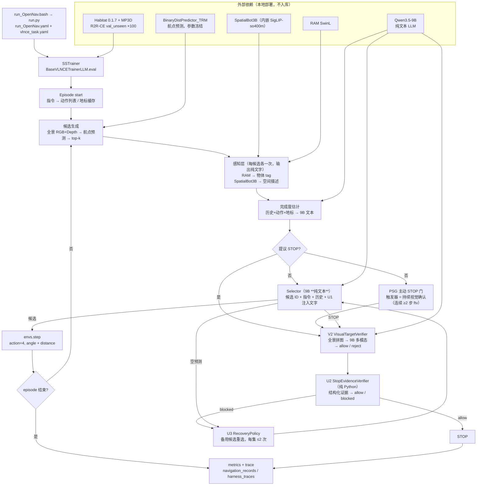

# Controlled Navigation Harness for Open-Nav

零样本 VLN-CE 的**受控诊断 harness**，基于 Open-Nav (ICRA 2025) 改造。
评测口径固定为 R2R-CE `val_unseen` 前 100 集，training-free，全程 oracle-free。

本仓库的主要产出不是性能数字，而是**一批被证据封死的路线**和支撑它们的可复算 trace。
下面第 2 节是当前唯一有效的基线，第 3 节是核心资产。

> 更新时间：2026-07-29 ｜ 基线锚点：`clean_baseline_v1`（2026-07-05）

## 1. 这是什么 / 不是什么

**是**：把 Open-Nav 的 LLM 耦合导航链路拆成显式状态 + 结构化 trace，
使每一步的候选、证据、终止裁决、失败归因都可离线复算与消融。

**不是**：

- 不训练或微调 policy（训练线已开题又关闭，见 §3）。
- 不追求榜单名次——本项目当前水平就是 Open-Nav 的忠实复现，见 §4。
- 不做自由工具调用 Agent（L0–L5 路线 2026-07-06 战略重置后休眠，未推进）。

## 2. 当前基线（唯一有效 headline）

`clean_baseline_v1` — Qwen3.5-9B，oracle-free，commit tag 锁定，贪心 + 固定 seed 逐字节可复现。

| 指标 | 值 |
|---|---:|
| SR | **16%** |
| OSR | 21% |
| OSR→SR 转化 | 76.2% |
| SPL | 0.1283 |
| nDTW | 0.4200 |
| 平均步数 | 6.5 |
| 平均 DTG | 7.61 m |

- 真源：`logs/eval_results/ep100/20260705/clean_baseline_v1_20260705_103023/`
- Trace：`logs/harness_traces/ep100/20260705/clean_baseline_v1/`
- 核数脚本：`paper_analysis/verify_paper_numbers.py`

**失败结构**：假停 56 集（平均 8.3 m）、步数耗尽 23 集、擦边 5 集。
终止请求占 72/100 —— 模型扣扳机过快。
OSR 有而 SR 无的存量只剩 5 集，故 SR 增量必须靠新挣的 OSR 集。

### ⚠ 已作废的历史数字

| 出处 | 曾报 | 状态 |
|---|---|---|
| `max_config` 2026-06-28 | SR 21% | ❌ oracle 污染，作废 |
| E3 carry_forward 2026-06-30 | SR 24% | ❌ oracle 污染，作废 |
| Run1 (9B+E5) 2026-07-02 | SR 24% | ❌ oracle 污染，作废 |

根因是**单一变量** `latest_goal_dist`（= 模拟器测地目标距离 GT，与 SR/NE 同源）
喂给 7 个消费者，其中 5 个在推理路径 branch。最决定性的是 E5 far-block
（168 次 / 39 集）。干净重跑 **−8 SR，p=0.022**。
完整审计见 `docs/research_memory/project_oracle_leak_20260704.md`。

**残留未清**：`phase_evidence.py:149` 的 `recover` 分支仍读 `recent_distance_gains`
（GT 差分），实测 51 次 phase 由该量决定，且 U1 决策生效。
**不阻塞跑实验，但阻塞 SR=16 写进论文。**

### 增量开关的最好实测

2026-07-19 那轮（depth veto + 回溯同开）= SR 20 / OSR 25 / SPL 0.155，
但配对 McNemar **p=0.388 不显著**（8 涨 4 跌），归因为轨迹扰动而非机制生效。
当前配置维持两开关为 True（关掉有真实期望代价），但不再投入。

## 3. 已结算的路线（核心资产）

每条都有预注册闸门、实测和判决。**提新方案前先对照这张表。**

| # | 路线 | 闸门 | 实测 | 判决 |
|---|---|---|---|---|
| 1 | **深度否决** stop veto | 存在净正操作点 | 停止时刻前向深度对成败 **AUROC 0.531**；阈值 2.0–8.0 m 全扫描无净正点（T=3.0：拦 5 成功换 16 失败） | ❌ 20260719 |
| 2 | **位移回溯** backtrack | 影响 SR | offered 156 / applied **3**（接受率 1.9%），3 集均不在涨跌名单 | ❌ 20260719 贡献为 0 |
| 3 | **候选先验重排** Arm C | 离线效应 ≥0.5 m/集 | 离线命中 44.1% vs LLM 36.7%，但在线净 **+1 SR，p=1.000**；中介检验仅 **−0.094 m/步** | ❌ 20260720 命中率≠转化 |
| 4 | **打分头**（标量特征） | 折外 regret ≤0.85 | 命中 36.8→44.2%，但米制 regret 0.957→0.940 = **+0.12 m/集**（闸门 0.5） | ❌ 20260720 标量触底 |
| 5 | **G1 隐藏态探针** | 折外 regret ≤0.85 | 9B 隐藏态线性读 ≈ 随机（AUROC 0.52，regret 1.16 劣于基线 0.995），加 8× 容量无改善 | ❌ 20260724 决定性 |
| 6 | **换 backbone** | 救得回选路 | 有监督 BoW 探针 34.2% ≈ 零样本 9B 33.2% → **9B 已把文本信息榨干**，换基座只能榨同一份文本 | ❌ 20260724b |
| 7 | **M1 多模态选路** | 图像臂命中 ≥50% | 9B 41.0% / qwen3-vl-plus 43.0% / omni-plus 39.0% → **平台，非分辨率所限**（512→1024 不再涨） | ❌ 20260727 三档规模一致 FAIL |
| 8 | **waypoint 路线** | 覆盖是瓶颈 | 航点 98% 精确到达；前向候选 84% 步存在、真死胡同仅 11–16%；所选候选 48% 走远 / 48% 走近 = 随机游走 | ❌ 20260702 覆盖不是瓶颈，选路是 |

另有 **P0 几何注入**：配对 McNemar p=0.21，点估计为负 → 降级为 "naive 注入无显著增益"，
可反驳"信息量是瓶颈"，但不能声称有害。

### 两条方法论结论

- **命中率不等于 SR**。第 3/4/5 条独立三次确认：选中最优候选率提升不转化为米制 regret，
  更不转化为 SR。**闸门一律落在失败结构侧**（假停数 / OSR / 倒退次数 / 转化率），
  不再设"命中最优候选率"类闸门。
- **M1 的 null 有信息量，非伪 null**。错配图对照（给每个选项配邻居的图）命中掉到 18–20%，
  **低于随机**，三个独立模型全部复现（p≈0.001）→ 模型确实在读像素。

## 4. 差距定位：架构代际，不是实现质量

**SPL 12.8 vs Open-Nav 论文 12.9 → 本项目是对 Open-Nav 的忠实复现。**
而 zero-shot R2R-CE `val_unseen` 赛道 18 个月内已走到：

| 方法 | SR |
|---|---:|
| SpaceVLN | 53.3 |
| GTA | 48.8 |
| HSGM | 47.9 |
| VLN-Zero | 42.4 |
| SmartWay | 29.0 |
| **Open-Nav（本项目所在代际）** | **~16** |

**所有 40%+ 的方法都有本 pipeline 没有的两样东西：持久空间记忆 + 分层规划。**
SpaceVLN 消融：w/o 空间记忆 −14.4 / w/o 地标记忆 −10.4 / w/o planner-CoT −8.5。
关键一行：**剥掉全部记忆与 CoT 仍有 37.3** → planner/executor 分层 + 原语动作空间 +
锚点链这个**骨架本身**就远强于逐步航点选择。

### 对既有结论的两条修正

1. **M1 的 null 只界定"无记忆单步选择"的上界（43%）**，未界定"有空间记忆时"的上界。
2. **"选择层近随机"需重新归因**：无记忆策略在局部选择本来就接近随机，
   是架构没给状态，不是模型缺陷。本项目"失败集随机游走 48% 走远"正是该症状。

⚠ 限定：复现 SOTA 打折；上表未逐篇核对口径（航点预测器 / 步数预算 / 集划分），引用前须复核。

全文见 `Controlled-Navigation-Harness/docs/架构对照-SOTA差距与改造路径-20260727.md`。

## 5. 当前方向：ACN 锚点链导航

把"逐步无记忆航点选择"改成"锚点链 + 空间记忆 + 分层规划"，
并把进度定位从**问 LLM** 改成**度量 + 状态机**。

设计草案：`Controlled-Navigation-Harness/docs/新框架设计-ACN锚点链导航-20260727.md`

| 阶段 | 内容 | 成本 |
|---|---|---|
| 0 | 禁停跑一轮测真实 OSR 上界 + 加大 `SHORT/LONG_ACTION_STEP_LIMIT`（现 10/12）。判据：OSR≈23 → 须动骨架；OSR≈40+ → 先修停止 | 几小时 |
| 1 | `MEMORY_DIAGNOSTIC.LOG_ONLY→False`（跨步避免重访，与已证伪的"步内重排"机制不同）。⚠ **不是"一个 flag"**：`MEMORY_DIAGNOSTIC` 在 `harness_config.py:279-301` 的强制 LOG_ONLY 名单里且无豁免，翻开关会直接 `ValueError`，须同步改该守卫 | 一个 flag + 一个守卫 + 一轮 |
| 2 | planner/executor 分离 + 锚点链进度定位 + 持久 Spatial Waypoint 图 + 跨步地标池 + 三重合取终止 | 几周，重写 |
| 3 | `qwen3.5-plus`（规划）+ `qwen3.5-flash`（执行）分工 | — |

⚠ **不得假设翻开关就有 +14.4**：现有 `visual_graph_memory.py` 只有位置历史 + 距离，
没有区域 / 楼层 / 可达边，是 visit-info 的薄片。

设计纪律（P1–P5）：语言归 LLM、定位归度量；结构约束优先于模型能力；
闸门不看命中率；一切新读取量先过 oracle 审计；LOG_ONLY 先行。

## 6. 架构与数据流



### 读图要点（含已证伪项）

- **选择器全程不看图像**。routing 由 9B **纯文本** LLM 完成，它只读 SpatialBot / RAM 生成的文字；
  只有 STOP 验证（V2）走多模态。这一点长期被误记为"多模态选路"。
- **每步真实 VLM 调用 5~6 次**（`observe_view` 每候选一次），不是每步 1 次。
- **`completion_estimation` 已自证伪**：与真实进度 r=0.12，75 次进度倒退；每步约 15.7 s。
- **`observe_view` 的距离是语言先验**（r=0.175），日志实证有"镜子 20 米"级读数。
- 上述两项合计约 43% 耗时，产出经不起检验——ACN 阶段 2 直接替掉。
- SigLIP 是 SpatialBot3B 的 `mm_vision_tower`，随模型加载，**不是独立模块**。
- 死代码：`visual_graph_memory.py`、`landmark_matching.py` 在主循环 **0 引用**。

## 7. 承重约束（改代码前必读）

| 约束 | 位置 | 后果 |
|---|---|---|
| U1(`PHASE_EVIDENCE`) ↔ V4(`MULTIMODAL_SELECTOR_CONTEXT`) **不可同时决策生效** | `harness_config.py:268-274` | 违反直接 `ValueError`。"把 UV 系列全打开"无物理解，真正的选择只有二选一 |
| `GEOMETRY_QUERY` / `GROUNDER_DIAGNOSTIC` / `MEMORY_DIAGNOSTIC` / `CONTEXT_BUILDER` / `ORACLE_METRICS` / `VISUAL_EVIDENCE` / `VISUAL_EVIDENCE_MEMORY` **强制 LOG_ONLY** | `harness_config.py:279-301` | 违反直接 `ValueError`。V2 / V4 在 `ENABLE_DECISION_EFFECT` 下豁免，其余无豁免 |
| `generate_input` **必须跳过 `tilt_` 前缀键** | RGB 按 `observations.keys()` **位置**编号 | 多一路传感器进扫描会**静默旋转整个方向映射**且不报错 |
| 开关生效回显 `[HARNESS SWITCHES]` | `base_il_trainer_llm.py`，episode loop 前 | 2026-07-18 曾因无回显白跑 9 小时（YACS 尾参未透传，逐集与基线逐字节相同）。开关现已写死进 yaml |
| 贪心 + 固定 seed | 后端 = transformers direct-generate bf16 | 管线逐字节可复现，配对 McNemar 无运行间噪声 |
| 无断点续跑 | — | 宿主会无预警掉电；`logs/navigation_records/` 逐集追加是唯一救命记录 |

## 8. 运行方式

```bash
conda activate opennav
bash run_OpenNav.bash
```

配置入口：`run_OpenNav.yaml`、`habitat_extensions/config/vlnce_task.yaml`。
9B 服务由 `serve_qwen.sh` 启停。起跑后数秒确认 `[HARNESS SWITCHES]` 横幅与预期一致。

当前关键开关：

```yaml
OPENNAV_HARNESS:
  ENABLED: true
  ENABLE_DECISION_EFFECT: true
  TRACE_DIR: logs/harness_traces/clean_baseline_v1
  GEOMETRY_INJECTION: false        # P0，前测净负
  VISUAL_EVIDENCE:      { LOG_ONLY: true  }   # V1
  VISUAL_TARGET_VERIFIER: { LOG_ONLY: false } # V2，含 DEPTH_STOP_VETO
  MULTIMODAL_SELECTOR_CONTEXT: { LOG_ONLY: true }  # V4，与 U1 互斥
  CANDIDATE_PRIOR:      { LOG_ONLY: false }   # Arm C，已结算但维持
  ENDGAME_TILT_VIEW:    { LOG_ONLY: true  }
  BACKTRACK:            { ENABLED: true   }   # 已证伪，维持不动
```

## 9. 数据与日志

| 路径 | 内容 |
|---|---|
| `data/datasets/.../OpenNav_R2R-CE_100_bertidx.json.gz` | 100 集指令 / 路径 / BERT index；**目标坐标也在这里**，选择层可离线复算 |
| `logs/navigation_records/` | 每轮导航 JSONL 事件流（150 个文件，全部入库） |
| `logs/harness_traces/` | 按 episode 拆分的结构化 trace（2471 个文件，全部入库） |
| `logs/eval_results/` | aggregate / per-episode 指标 |
| `paper_analysis/` | 论文草稿 + `verify_paper_numbers.py` + `episode_metrics.json`——**数字唯一真源** |

**离线复算约定**：候选世界坐标由 `step_start` 位姿 + `waypoint_candidates` 的
`angle_rad`/`distance` 重建，**θ = −heading − angle_rad**，`x += d·sin(θ)`，`z −= d·cos(θ)`。
该约定是标定出来的（四种候选约定预测误差中位 1.821 / 1.670 / 1.338 / **0.000** m）。
**分析选择层不需要重跑评测。**

## 10. 文档索引

| 文档 | 用途 |
|---|---|
| `Controlled-Navigation-Harness/docs/current_task.md` | **滚动任务状态**，当前事实与执行队列的权威快照 |
| `Controlled-Navigation-Harness/docs/架构对照-SOTA差距与改造路径-20260727.md` | 差距定位（§4 出处） |
| `Controlled-Navigation-Harness/docs/新框架设计-ACN锚点链导航-20260727.md` | 当前方向设计草案（§5 出处） |
| `Controlled-Navigation-Harness/docs/全链条梳理-感知认知决策执行反馈-20260720.md` | 活文档：五环节实现与瓶颈判定，含已排除路线表 |
| `Controlled-Navigation-Harness/docs/INDEX.md` | 全部文档三层分类（现行 / 参考 / 归档） |
| `docs/research_memory/` | 实验决策链记录，入口 `MEMORY.md` |
| `MIGRATION.md` | **迁移到新机器**：第三方库链接、habitat 补丁、环境重建、模型下载与校验和 |
| `patches/README.md` | 无法从任何远端恢复的本地改动 |

`Controlled-Navigation-Harness/archive/` 下为已 superseded 的历史方案，**停止引用**。

## 11. 依赖和大文件

第三方源码库、模型快照和场景资产不入库。**逐条链接、版本号和校验和见
[`MIGRATION.md`](MIGRATION.md)**，此处仅列路径：

```text
data/scene_datasets/mp3d/                                    # 21G，官方脚本已在库内
external/habitat-lab-v0.1.7/                                 # ⚠ 必须打 patches/ 下的补丁
SpatialBot/  SpatialBot3B/  recognize_anything/              # ⚠ SpatialBot3B 需覆盖两个本地文件
waypoint_prediction/checkpoints/check_val_best_avg_wayscore
data/pretrained_models/ddppo-models/gibson-2plus-resnet50.pth
recognize_anything/pretrained/ram_swin_large_14m.pth
/root/models/{Qwen3.5-4B, Qwen3.5-9B, google-siglip-so400m-patch14-384}
```

## 12. 原 Open-Nav 信息与归属

本项目基于 Open-Nav：

- Project website: <https://sites.google.com/view/opennav>
- Paper: <https://arxiv.org/pdf/2409.18794>
- Original repository: <https://github.com/YanyuanQiao/Open-Nav>

```bibtex
@inproceedings{qiao2025opennav,
  author    = {Yanyuan Qiao and Wenqi Lyu and Hui Wang and Zixu Wang and Zerui Li and Yuan Zhang and Mingkui Tan and Qi Wu},
  title     = {Open-Nav: Exploring Zero-Shot Vision-and-Language Navigation in Continuous Environment with Open-Source LLMs},
  booktitle = {Proceedings of the IEEE International Conference on Robotics and Automation (ICRA)},
  year      = {2025}
}
```

This repository builds on Open-Nav and includes or references components from DiscussNav,
Discrete-Continuous-VLN, Habitat-Lab, SpatialBot, and Recognize Anything Model.
Third-party licenses and original source references should be preserved when using or
redistributing this code.
