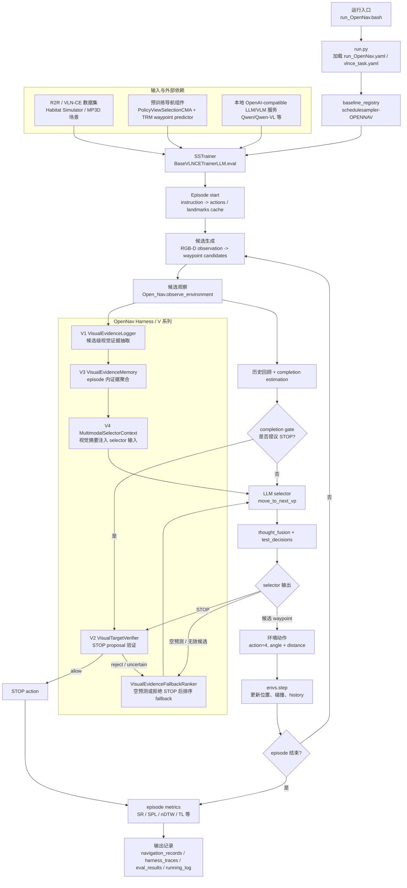

# Controlled Navigation Harness for Open-Nav

本仓库记录一个基于 Open-Nav 的 VLN-CE 实验项目。当前重点不是复现原论文主页，而是把 Open-Nav 的 LLM-centered navigation pipeline 改造成可诊断、可消融、可回放的 controlled navigation harness。

原始 Open-Nav 作为 waypoint-based baseline 保留。本项目在其外层逐步加入显式状态、视觉证据、STOP 验证、selector context、fallback 排序和结构化 trace，用来分析零样本连续环境导航中的失败来源。

## 实验目标

本项目要回答的问题是:

> 能否将 Open-Nav 中由 LLM 耦合承担的导航职责，重构为一个受控 navigation harness，使进度、候选、记忆、验证和恢复都成为显式状态与工具接口，从而提高 VLN-CE 零样本导航的可诊断性、可消融性，并为后续受限恢复机制提供可靠触发依据？

当前不做:

- 不训练或微调新 policy。
- 不切换到 waypoint-free 主链。
- 不做自由工具调用式 LLM Agent。
- 不引入在线多 sub-agent 协作。
- 不把模型升级和模块收益混在同一组实验里。

## 项目框架流程图

下图按当前代码主链整理，重点展示 Open-Nav 原始导航闭环如何被本项目的 controlled navigation harness 包裹。`external/habitat-lab-v0.1.7`、`recognize_anything`、`SpatialBot` 等外部依赖或候选模型资源不展开到内部实现。



关键读法:

- `run_OpenNav.yaml` 是当前 V 系列开关的主要来源；`ENABLE_DECISION_EFFECT=true` 且对应模块 `LOG_ONLY=false` 时，V2/V4 才会真实改变导航决策。
- V1 负责把候选 RGB 视角转成结构化视觉证据；V3 把证据聚合成 episode 内记忆；V4 把候选级视觉摘要追加到 selector 输入；V2 对 completion gate 或 selector 提出的 STOP 做保守验证。
- 原始 Open-Nav 的 `move_to_next_vp -> thought_fusion -> test_decisions -> envs.step` 闭环保留，harness 主要在候选证据、STOP gate、fallback、trace 日志四个位置介入。

## 当前状态

更新时间: 2026-06-15

当前主线: V 系列多模态视觉证据 + V2/V4 decision-effect 修正。

核心判断:

- V1 visual evidence schema 问题已经修复，裸数组输出会被规范化为 `{"candidates": [...]}`。
- V4 selector context 和 visual ranked fallback 已经能消费候选级视觉证据。
- 小样本中 V2/V4 有正向信号，但 100 episode 结果还不能作为稳定改进结论。
- 当前主要风险从“视觉证据未被消费”转为 “V2 STOP allow 过宽”，尤其是泛化目标词和 `completion_gate` 来源的 STOP。
- 下一步应先跑 10 到 12 episode 小样本验证 STOP 修复，不应直接跑 100 episode。

## 阶段划分

阶段顺序:

```text
A0/A1 固定可比基线
  -> B/C 只记录证据和状态
  -> D/E/F 让证据进入决策链
  -> G 降低运行成本
  -> H 单独评估模型升级
```

A 阶段用于保证可比性。B/C 阶段主要产生日志和诊断证据。D/E/F 阶段才允许改变导航行为。G/H 属于后续优化，不能混入当前 V2/V4 主实验收益。

| 阶段 | 类型 | 核心问题 | 是否改行为 | 当前状态 |
|------|------|----------|------------|----------|
| A0 Baseline | 原始对照 | 原始 Open-Nav 在同一批 episode 上表现如何 | 否 | 保留为参照 |
| A1 Instrumented Baseline | 行为不变的 Harness 外壳 | 加日志、状态、trace 后是否仍与 A0 一致 | 否 | 已有初版，仍需 A0/A1 指标对齐 |
| B Evidence Logging | 候选级证据采集 | 每个 waypoint 候选是否有可解析语义/视觉证据 | 否 | V1 已实现，schema 修复已生效 |
| C Memory & State | episode 内状态聚合 | 单步证据能否沉淀为 seen target、arrival evidence、revisit/novelty | 主要 log-only | V3 已实现初版 |
| D Selector Context | 证据进入候选选择 | 候选级视觉摘要能否帮助 selector 选更合理的 waypoint | 是 | V4 已进入 decision-effect |
| E STOP Verification | STOP 验证 | STOP 是否有足够视觉证据支持，能否减少提前 STOP | 是 | V2 已接入，正在收紧 allow 规则 |
| F Fallback Policy | 失败恢复 | 空预测或 STOP 被拒后，能否替代 first-candidate fallback | 是 | visual ranked fallback 已接入，需继续复测 |
| G Runtime Policy | 运行成本控制 | 如何降低 VLM/LLM latency，同时不破坏证据覆盖率 | 是，但不应改变候选集合 | compact JSON、JPEG、token cap 已接入；adaptive sampling 暂缓 |
| H Model Upgrade | 模型升级对照 | 更强 depth encoder / waypoint predictor 是否带来独立收益 | 是，必须单独消融 | 待调研 |

阶段验收口径:

- A1 必须先证明 SR/SPL/NE/TL 与 A0 基本一致，才能把后续收益归因给 Harness 模块。
- B/C 的产物首先是日志质量，不直接声明导航性能收益。
- D/E/F 的收益必须分别看 selector 变化、STOP allow/reject case、fallback 后 distance gain。
- G/H 必须单独做对照，避免把运行策略或模型升级收益混入 V2/V4。

## V 系列模块

| 模块 | 代码入口 | 当前作用 |
|------|----------|----------|
| V1 VisualEvidenceLogger | `vlnce_baselines/common/opennav_ext/visual_evidence.py` | 对候选 RGB 视角抽取结构化视觉证据 |
| V2 VisualTargetVerifier | `vlnce_baselines/common/opennav_ext/visual_target_verifier.py` | 验证 STOP proposal，拦截或放行 STOP |
| V3 VisualEvidenceMemory | `vlnce_baselines/common/opennav_ext/visual_evidence_memory.py` | 聚合 episode 内视觉证据 |
| V4 MultimodalSelectorContext | `vlnce_baselines/common/opennav_ext/multimodal_selector_context.py` | 将候选级视觉摘要注入 selector 输入 |
| Visual fallback | `vlnce_baselines/common/opennav_ext/visual_fallback.py` | selector 空预测时用视觉证据排序候选 |
| Schema tools | `vlnce_baselines/common/opennav_ext/visual_evidence_schema.py` | 统一兼容 dict/list 形式的 V1 输出 |

## 数据集与日志

当前仓库已包含 OpenNav_R2R-CE_100 的 `val_unseen` 小规模评估数据:

| 文件 | 用途 |
|------|------|
| `data/datasets/R2R_VLNCE_v1-2_preprocessed/val_unseen/OpenNav_R2R-CE_100_bertidx.json.gz` | 100 个 R2R-CE / VLN-CE episode 的指令、路径和 BERT index 预处理数据，用于当前小样本与 100 episode 评估 |
| `data/datasets/R2R_VLNCE_v1-2_preprocessed/val_unseen/val_unseen_gt.json.gz` | `val_unseen` ground truth，用于 success、oracle_success、SPL、nDTW、distance_to_goal 等指标计算 |

已提交的实验日志目录:

| 目录 | 内容 | 汇报用途 |
|------|------|----------|
| `logs/navigation_records/` | 每轮导航的 JSONL 事件日志和 plain log | 复盘每个 episode 的动作、STOP、fallback、V1/V2/V4 事件 |
| `logs/harness_traces/` | 按 episode 拆分的 structured trace | 定位 selector context、STOP verifier、fallback 对具体 step 的影响 |
| `logs/eval_results/` | Habitat 评估输出的 aggregate / per-episode 指标 | 快速读取 SR、SPL、nDTW、distance 等指标 |
| `logs/running_log/` | shell / trainer 运行记录 | 检查启动配置、进程运行和异常终止 |
| `logs/downloads/` | 模型或依赖下载记录 | 追踪本地模型准备过程 |

## 已观察结果

### 日志索引

| ID | 日志文件 |
|----|----------|
| V4-100 | `logs/navigation_records/1/v_series_qwen_siglip_local_20260612_233128_train_navigation_20260612_233156.jsonl` |
| V24-10 | `logs/navigation_records/1/v24_series_qwen_siglip_local_20260613_112044_train_navigation_20260613_112112.jsonl` |
| R23-10 | `logs/navigation_records/v24_series_qwen_siglip_local_20260613_150848_train_navigation_20260613_150914.jsonl` |
| R23C-12 | `logs/navigation_records/v24_series_qwen_siglip_local_20260613_175536_train_navigation_20260613_175605.jsonl` |
| RR-100 | `logs/navigation_records/v24_series_qwen_siglip_local_20260613_212115_train_navigation_20260613_212143.jsonl` |
| PRE-11 | `logs/navigation_records/v24_series_qwen_siglip_local_20260614_101818_train_navigation_20260614_101847.jsonl` |
| FIX-11 | `logs/navigation_records/v24_series_qwen_siglip_local_20260614_122559_train_navigation_20260614_122628.jsonl` |

### 主要指标

| ID | 实验含义 | Ep | success | oracle | SPL | nDTW | mean DTG | 关键诊断 |
|----|----------|----|---------|--------|-----|------|----------|----------|
| V4-100 | 早期 V4-only 100 episode | 100 | 10/100 | 11/100 | 0.0921 | 0.4311 | 7.8584 | `parse_error=415/423`，视觉证据大多没有进入 selector |
| V24-10 | V2/V4 decision-effect 小样本 | 10 | 3/10 | 6/10 | 0.2863 | 0.6699 | 4.2091 | `parse_error=0/57`，`visual_stop_rejected=28`，V4 已真实进入 selector |
| R23-10 | V2-first STOP gate + visual ranked fallback | 10 | 5/10 | 7/10 | 0.4863 | 0.7105 | 3.4895 | 6 次 fallback 触发，10 episode 中表现最好，但仍有误 STOP 风险 |
| R23C-12 | conservative STOP / fallback 小样本 | 12 | 5/12 | 7/12 | 0.4053 | 0.6311 | 4.5635 | `visual_stop_allowed=0`，`visual_stop_rejected=36`，全部到 step limit |
| RR-100 | Runtime Reduce 100 episode | 100 | 19/100 | 24/100 | 0.1708 | 0.4797 | 7.4200 | latency 降低，但 compact schema 漂移导致 `mm_ctx zero=581/600` |
| PRE-11 | schema 修复前小样本 | 11 | 1/11 | 1/11 | 0.0693 | 0.4777 | 6.9756 | `mm_ctx zero=49/63`，fallback 缺少候选证据 |
| FIX-11 | schema 修复后小样本 | 11 | 4/11 | 4/11 | 0.3416 | 0.5844 | 5.7791 | `parsed_root_type=dict 60/60`，`mm_ctx zero=0/60`，fallback evidence 7/7 |

### 诊断结论

- 从 V4-100 到 V24-10，核心变化不是单纯加模块，而是把 V1 视觉证据从“记录到日志”推进到“能被 V4 selector context 消费”。`parse_error` 从 415/423 降到 0/57 后，success 从 10% 提升到 30%，oracle_success 从 11% 提升到 60%。
- R23-10 是当前小样本中最强的正向信号: success 5/10、SPL 0.4863、nDTW 0.7105、mean DTG 3.4895。它说明 visual ranked fallback 有价值，但样本量太小，不能直接写成最终结论。
- RR-100 说明“运行成本下降”和“导航效果提升”不能混为一谈。该轮 100 episode 的 visual evidence latency 均值约 15.18s/step，但 compact JSON 产生 schema 漂移，导致 V4/fallback 大量拿不到候选证据。
- PRE-11 到 FIX-11 是最清晰的 schema 修复对照: success 从 1/11 到 4/11，SPL 从 0.0693 到 0.3416，nDTW 从 0.4777 到 0.5844；同时 `candidate_evidence_count=0` 问题被清掉。
- STOP 仍是当前最大风险点。V2 能显著减少提前 STOP，但 `visual_stop_allowed` 的 evidence threshold 仍需收紧，尤其是 `completion_gate` 来源、泛化目标词、只看到相似类别但没有 arrival evidence 的情况。

## 下一步

优先级从高到低:

1. 跑 10 到 12 episode 小样本，验证 `completion_gate` 来源的泛化 STOP 不再被 V2 误放行。
2. 检查 `visual_stop_allowed` case study，确认 allow 必须有更强的 final target / arrival evidence。
3. 统计 `selector_empty_prediction_fallback.changed` 和 fallback 后的 distance gain。
4. 补充 schema warning: 合法 JSON 但非预期结构时，日志必须区分 parse error、schema error、empty evidence。
5. 在 V2/V4 稳定后，再恢复 R4 adaptive candidate sampling。
6. 最后再重跑 100 episode，不把小样本正向信号直接写成最终结论。

## 待改进事项

这些方向不直接替换当前主线 baseline，应作为独立 ablation 或后续分支评估，避免把模型升级收益和 Harness 模块收益混在一起。

| 方向 | 当前判断 | 注意事项 |
|------|----------|----------|
| DD-PPO depth encoder 替代 | Habitat DD-PPO 官方还有 SE-ResNeXt50 / SE-ResNeXt101 等更强深度编码器可调研 | 当前代码按 `VlnResnetDepthEncoder` + ResNet-50 权重结构加载，不能直接替换 checkpoint，需要改 backbone 和加载逻辑 |
| SmartWay-style waypoint predictor | 2025 SmartWay 方向用 DINOv2、masked cross-attention、occupancy-aware loss 强化 waypoint prediction，适合作为候选生成升级路线 | 这会改变 waypoint 候选质量和错误分布，应单独做 `Waypoint Predictor Upgrade` 对照，不应混入 V2/V4 主实验 |

下一轮必须检查的日志字段:

```text
visual_evidence.parsed_root_type
multimodal_selector_context.candidate_evidence_count
selector_empty_prediction_fallback.candidate_evidence_count
selector_empty_prediction_fallback.changed
visual_target_verifier.visual_evidence_candidate_count
visual_stop_allowed
visual_stop_rejected
visual_stop_uncertain
```

## 运行方式

基础运行:

```bash
bash run_OpenNav.bash
```

当前默认配置在:

```text
run_OpenNav.yaml
habitat_extensions/config/vlnce_task.yaml
```

当前关键配置:

```yaml
OPENNAV_HARNESS:
  ENABLED: true
  ENABLE_HARNESS_LOGGING: true
  ENABLE_DECISION_EFFECT: true

  VISUAL_EVIDENCE:
    ENABLED: true
    LOG_ONLY: true
    MAX_CANDIDATES: 4
    MAX_TOKENS: 768
    IMAGE_JPEG_QUALITY: 70
    COMPACT_JSON: true

  VISUAL_TARGET_VERIFIER:
    ENABLED: true
    LOG_ONLY: false
    CONFIDENCE_THRESHOLD: 0.9
    REQUIRE_ARRIVAL_EVIDENCE: true
    REQUIRE_FULL_COVERAGE_FOR_ALLOW: true
    BLOCK_GENERIC_FINAL_TERMS_FOR_ALLOW: true

  VISUAL_EVIDENCE_MEMORY:
    ENABLED: true
    LOG_ONLY: true

  MULTIMODAL_SELECTOR_CONTEXT:
    ENABLED: true
    LOG_ONLY: false
```

## 文档索引

| 文档 | 用途 |
|------|------|
| `Controlled-Navigation-Harness/项目总控.md` | 项目边界、阶段定义和文档入口 |
| `Controlled-Navigation-Harness/实验方案.md` | 完整实验方案和 harness 设计 |
| `Controlled-Navigation-Harness/V系列多模态视觉证据初步实现后调整方案.md` | V0-V4 初步实现后的问题复盘和下一轮矩阵 |
| `Controlled-Navigation-Harness/V系列多模态视觉证据实验记录-封存-20260613.md` | V 系列初步实现过程记录 |
| `Controlled-Navigation-Harness/docs/experiment_record_20260610.md` | 本地 Qwen / SigLIP A0 smoke、A1 logging 接入 |
| `Controlled-Navigation-Harness/docs/experiment_record_20260612.md` | STOP 控制链路、Thought Fusion、V0/V1/V2 前置验证 |
| `Controlled-Navigation-Harness/docs/experiment_record_20260614.md` | 100 episode / 小样本复盘、schema 修复和 STOP allow 修复 |
| `Controlled-Navigation-Harness/docs/code_review_issues.md` | 当前代码风险、fallback 和 schema 待修问题 |

## 依赖和大文件

本仓库已提交当前实验日志和 OpenNav_R2R-CE_100 的 `val_unseen` 小规模评估数据。第三方源码库、模型快照和场景资产只作为本地依赖保留，不作为仓库内容提交。以下路径需要按本地环境自行准备:

```text
data/scene_datasets/mp3d/
external/
recognize_anything/
SpatialBot/
SpatialBot3B/
waypoint_prediction/checkpoints/check_val_best_avg_wayscore
data/pretrained_models/ddppo-models/gibson-2plus-resnet50.pth
recognize_anything/pretrained/ram_swin_large_14m.pth
SpatialBot3B/model-00001-of-00002.safetensors
SpatialBot3B/model-00002-of-00002.safetensors
```

当前 `.gitignore` 已排除:

- `cache_files/`
- `image_show/`
- `navigator_log.log`
- `logs/checkpoints/`
- `__pycache__/`
- `data/scene_datasets/mp3d/`
- `*.safetensors`
- `*.pth`
- `waypoint_prediction/checkpoints/`
- `SpatialBot/`
- `SpatialBot3B/`
- `recognize_anything/`
- `external/`
- `rag/`

## 原 Open-Nav 信息

本项目基于 Open-Nav:

- Project website: <https://sites.google.com/view/opennav>
- Paper: <https://arxiv.org/pdf/2409.18794>
- Original repository remote in this workspace: `https://github.com/YanyuanQiao/Open-Nav`

原 Open-Nav 论文:

```bibtex
@inproceedings{qiao2025opennav,
  author    = {Yanyuan Qiao and Wenqi Lyu and Hui Wang and Zixu Wang and Zerui Li and Yuan Zhang and Mingkui Tan and Qi Wu},
  title     = {Open-Nav: Exploring Zero-Shot Vision-and-Language Navigation in Continuous Environment with Open-Source LLMs},
  booktitle = {Proceedings of the IEEE International Conference on Robotics and Automation (ICRA)},
  year      = {2025}
}
```

## Acknowledgements

This repository builds on Open-Nav and includes or references components from DiscussNav, Discrete-Continuous-VLN, Habitat-Lab, SpatialBot, and Recognize Anything Model. Third-party licenses and original source references should be preserved when using or redistributing this code.
